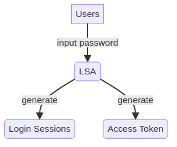
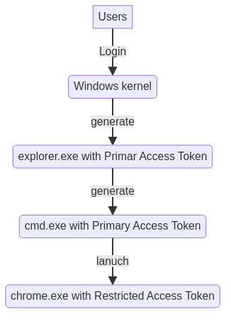

# Introduction Windows Auth workflow



A Logon session can have `multiple access tokens` associated with it, but an access token can only ever be linked to `one logon sessions`

```
+---------------------------+                +---------------------------+
|       Logon Session       |                |       Access Token        |
+---------------------------+                +---------------------------+
|Logon Session: 000..:01c.. |                |User: Company\admin        |
|User: Company\admin        |<---------------|AuthID: 000..:01c...       |
|Logon Tyle: interactive    |                |Integrity: Medium          |
|Session: 1                 |                |Users SID: S-1-5...        |
+---------------------------+                +---------------------------+
```

The `Logon Session` == `AuthID`

The acess tokens act as a `proxy or stand-in for the login session`. developers never interact with the logon session itself, but with an acess token which represents it

The acess token represents the security context of the user. An access token caches a number of attributes which determine tis security context, such as:

- The security identifier (SID) for the user
- Group memberships
- Privieges held
- A logon ID which refernces the origin logon session

whnever a thread attempts to access securable object managed by the Windows kernel, eg: PROCESS, THREAD, HANDLE, SEMAPHORE, TOKEN, etc., Windows will perform an access check

- Who is requesting access?
- What are their intentions with the object?
- who can access the object?

So the windows kernel:

1. Check the token associated with the calling thread
2. look at the authorization attributes cached in it (e.g. user sid..)
3. Check your intentions upfront, the access check only occurs once beacuse of the performance reasons (unless user attempts to perform an action that the handle did not have rights, e.g., wirte to read-only handle)
4. retrieve the security descriptor ffor the target object, The secrutiy descriptor contains a discretionary access control list(DACL) which specifies what users/groups have access to the object and the type of access granted.

Based on these three sources of intormation, kernel will give us boolean answer to whether a principal has access to a given object.

`SeDebugPriviege` privilege, the Windows kernel will skip the DACL checks for any process and thread objects.

Chrome can modify tis local copy of the token without affecting other applications. This can be achieved via APIs as `AdjustTokenGroups` / djustTokenPrivieges`Which can disable dangerous groups and privileges. or use`CreateRestrictedToken` to create restricted copy of access token



## Remote auth

```powershell
new view \\FILE01
```

Windows will always use the credentials cached in the logon session that the access token is linked to when authenticating remotely

+----------------+ +----------------+ +----------------+
|Access Token |->|Logon Session |->|Cached Cred |
+----------------+ +----------------+ +----------------+

In order to establish a new logon session, the SMB server will need to authenticate the client over the network. In Active Directory ENV, the authentication method is Kerberos or NTLM. After receiving au authentication request the target host will forward the credential information to the DC and, following successful authentication, establish a new network login session for the user.

Network logins do not cache credentials and therefore you cannot use this token to authenticate to another remote host.

The key point is that the newly minted access token which represents the netwokr logon of the remote client.

## Impersonation

The impersonation allows a thread to switch to a different security context. This is the best way to remember the disinction between primary and impersonation tokens, in that impersonation tokens are always applied to threads, whereas primary tokens are associated with processes.In this way, the SMB server can handle each incoming client request int a separate thread and impersonate the access token representing the remote client

- The user is authenticated and a new logon session is created (NETWORK_ONLY)
- The server process is presented with a handle to an impersonation token which links back to the remote client's new network logon session
- The server can use this token to `impersonate` the client to perform work on ther behalf.

This approach has the added benefit of making use of the existing Windows’ access control model, as all actions performed while impersonating are under the security context of the user’s identity (hence any local access check decisions will use the information cached in the impersonated user’s token). Therefore, if that user does not already have access to a specific file on a share, they will be denied access

`The server needs only to call the appropriate API in order to obtain a handle to the remote clients’ security context`
