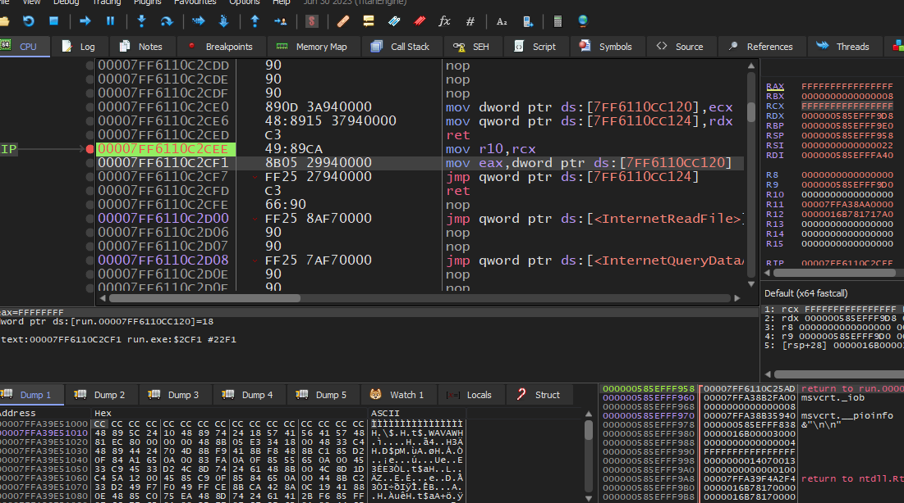

# Indirect syscalls

Indirect syscalls are a way to call a syscall indirectly, it does not use the `syscall` instruction, instead it uses a `jmp` instruction to jump to the address of the syscall.

```
        our assembly                            ntdll.dll
+-----------------------+             +-----------------------+
|                       |             |                       |
| mov exa, <ssn>        |             | mov exa, <ssn>        |
| jmp <addr of syscall> | ----------->| syscall               |
|                       |             | ret                   |
+-----------------------+             +-----------------------+
```



