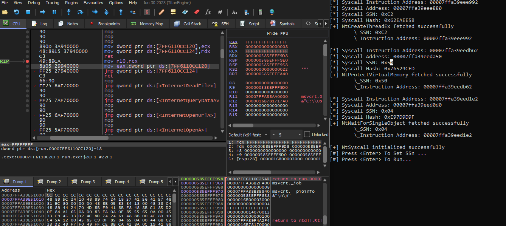

# Indirect syscalls

Indirect syscalls are a way to call a syscall indirectly, using a function pointer. This is useful for syscalls that are not directly available in the syscall table, or for syscalls that are not available in the current kernel version.

```
        our assembly                            ntdll.dll
+-----------------------+             +-----------------------+
|                       |             |                       |
| mov exa, <ssn>        |             | mov exa, <ssn>        |
| jmp <addr of syscall> | ----------->| syscall               |
|                       |             | ret                   |
+-----------------------+             +-----------------------+
```




