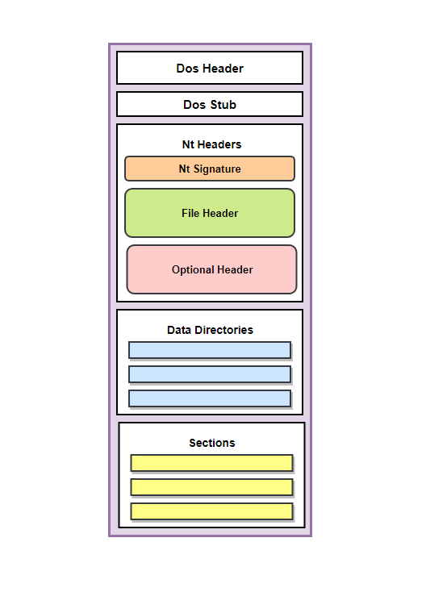

# Windows Portable Executeable Format

## PE Structure

- Dos Header

- Dos Stub

- Nt Headers => (nt_signature | file_header | optional_header)

- Data Directories

- Sections



## Dos Header

PE file prefix with MZ(0x4D, 0x5A)

```c
typedef struct _IMAGE_DOS_HEADER {      // DOS .EXE header
    WORD   e_magic;                     // Magic number
    WORD   e_cblp;                      // Bytes on last page of file
    WORD   e_cp;                        // Pages in file
    WORD   e_crlc;                      // Relocations
    WORD   e_cparhdr;                   // Size of header in paragraphs
    WORD   e_minalloc;                  // Minimum extra paragraphs needed
    WORD   e_maxalloc;                  // Maximum extra paragraphs needed
    WORD   e_ss;                        // Initial (relative) SS value
    WORD   e_sp;                        // Initial SP value
    WORD   e_csum;                      // Checksum
    WORD   e_ip;                        // Initial IP value
    WORD   e_cs;                        // Initial (relative) CS value
    WORD   e_lfarlc;                    // File address of relocation table
    WORD   e_ovno;                      // Overlay number
    WORD   e_res[4];                    // Reserved words
    WORD   e_oemid;                     // OEM identifier (for e_oeminfo)
    WORD   e_oeminfo;                   // OEM information; e_oemid specific
    WORD   e_res2[10];                  // Reserved words
    LONG   e_lfanew;                    // Offset to the NT header
  } IMAGE_DOS_HEADER, *PIMAGE_DOS_HEADER;

```

## Nt Headers

```c
// 32 bit
typedef struct _IMAGE_NT_HEADERS {
    DWORD Signature;
    IMAGE_FILE_HEADER FileHeader;
    IMAGE_OPTIONAL_HEADER32 OptionalHeader;
} IMAGE_NT_HEADERS32, *PIMAGE_NT_HEADERS32;

// 64 bit
typedef struct _IMAGE_NT_HEADERS64 {
    DWORD                   Signature; // Signature
    IMAGE_FILE_HEADER       FileHeader; // File Header
    IMAGE_OPTIONAL_HEADER64 OptionalHeader; // Optional Header
} IMAGE_NT_HEADERS64, *PIMAGE_NT_HEADERS64;

```

## File Header

```c
typedef struct _IMAGE_FILE_HEADER {
    WORD  Machine; // 0x14c => i386 (32 bit) 0x8664 => x64 (64 bit)
    WORD  NumberOfSections; // Number of Sections in the File
    DWORD TimeDateStamp; // Time and Date Stamp of File
    DWORD PointerToSymbolTable; // File Offset of COFF Symbol Table (0x0)
    DWORD NumberOfSymbols; // Number of Symbols
    WORD  SizeOfOptionalHeader; // Size of Optional Header (0xe0)
    WORD  Characteristics; // File Characteristics (0x0102 => Executable) (0x8180 => DLL)
} IMAGE_FILE_HEADER, *PIMAGE_FILE_HEADER;

```

## Optional Header

```c
// 32 bit
typedef struct _IMAGE_OPTIONAL_HEADER32 {
    WORD                 Magic; // Magic Number (0x10b => 32 bit) (0x20b => 64 bit)
    BYTE                 MajorLinkerVersion; // Major Linker Version
    BYTE                 MinorLinkerVersion; // Minor Linker Version
    DWORD                SizeOfCode; // Size of Code
    DWORD                SizeOfInitializedData; // Size of Initialized Data
    DWORD                SizeOfUninitializedData; // Size of Uninitialized Data
    DWORD                AddressOfEntryPoint; // Address of Entry Point
    DWORD                BaseOfCode; // Base of Code
    DWORD                BaseOfData; // Base of Data
    DWORD                ImageBase; // Image Base
    DWORD                SectionAlignment; // Section Alignment
    DWORD                FileAlignment; // File Alignment
    WORD                 MajorOperatingSystemVersion; // Major Operating System Version
    WORD                 MinorOperatingSystemVersion; // Minor Operating System Version
    WORD                 MajorImageVersion; // Major Image Version
    WORD                 MinorImageVersion; // Minor Image Version
    WORD                 MajorSubsystemVersion; // Major Subsystem Version
    WORD                 MinorSubsystemVersion; // Minor Subsystem Version
    DWORD                Win32VersionValue; // Win32 Version Value
    DWORD                SizeOfImage; // Size of Image
    DWORD                SizeOfHeaders; // Size of Headers
    DWORD                CheckSum; // Check Sum
    WORD                 Subsystem; // Subsystem
    WORD                 DllCharacteristics; // DLL Characteristics
    DWORD                SizeOfStackReserve; // Size of Stack Reserve
    DWORD                SizeOfStackCommit; // Size of Stack Commit
    DWORD                SizeOfHeapReserve; // Size of Heap Reserve
    DWORD                SizeOfHeapCommit; // Size of Heap Commit
    DWORD                LoaderFlags; // Loader Flags
    DWORD                NumberOfRvaAndSizes; // Number of Data Directories
    IMAGE_DATA_DIRECTORY DataDirectory[IMAGE_NUMBEROF_DIRECTORY_ENTRIES]; // Data Directories
} IMAGE_OPTIONAL_HEADER32, *PIMAGE_OPTIONAL_HEADER32;

// 64 bit
typedef struct _IMAGE_OPTIONAL_HEADER64 {
    WORD                 Magic; // Magic Number (0x10b => 32 bit) (0x20b => 64 bit)
    BYTE                 MajorLinkerVersion; // Major Linker Version
    BYTE                 MinorLinkerVersion; // Minor Linker Version
    DWORD                SizeOfCode; // Size of Code (.text section)
    DWORD                SizeOfInitializedData; // Size of Initialized Data
    DWORD                SizeOfUninitializedData; // Size of Uninitialized Data
    DWORD                AddressOfEntryPoint; // Address of Entry Point. main function
    DWORD                BaseOfCode; // Base of Code (.text section)
    ULONGLONG            ImageBase; // Image Base
    DWORD                SectionAlignment; // Section Alignment
    DWORD                FileAlignment; // File Alignment
    WORD                 MajorOperatingSystemVersion; // Major Operating System Version
    WORD                 MinorOperatingSystemVersion; // Minor Operating System Version
    WORD                 MajorImageVersion; // Major Image Version
    WORD                 MinorImageVersion; // Minor Image Version
    WORD                 MajorSubsystemVersion; // Major Subsystem Version
    WORD                 MinorSubsystemVersion; // Minor Subsystem Version
    DWORD                Win32VersionValue; // Win32 Version Value
    DWORD                SizeOfImage; // Size of Image
    DWORD                SizeOfHeaders; // Size of Headers
    DWORD                CheckSum; // Check Sum
    WORD                 Subsystem; // Subsystem
    WORD                 DllCharacteristics; // DLL Characteristics
    ULONGLONG            SizeOfStackReserve; // Size of Stack Reserve
    ULONGLONG            SizeOfStackCommit; // Size of Stack Commit
    ULONGLONG            SizeOfHeapReserve; // Size of Heap Reserve
    ULONGLONG            SizeOfHeapCommit; // Size of Heap Commit
    DWORD                LoaderFlags; // Loader Flags
    DWORD                NumberOfRvaAndSizes; // Number of Data Directories
    IMAGE_DATA_DIRECTORY DataDirectory[IMAGE_NUMBEROF_DIRECTORY_ENTRIES]; // Data Directories
} IMAGE_OPTIONAL_HEADER64, *PIMAGE_OPTIONAL_HEADER64;
```

the data directories are an array of IMAGE_DATA_DIRECTORY structures. Each structure contains the RVA and size of a specific data directory. The number of data directories is defined by the NumberOfRvaAndSizes field in the optional header.

```c
typedef struct _IMAGE_DATA_DIRECTORY {
    DWORD VirtualAddress; // RVA of the Data Directory
    DWORD Size; // Size of the Data Directory
} IMAGE_DATA_DIRECTORY, *PIMAGE_DATA_DIRECTORY;
```

can use the following code to get the data directories

```c
PIMAGE_DATA_DIRECTORY data_directory = (PIMAGE_DATA_DIRECTORY) &optional_header->DataDirectory;
```

can use the following code to get the specific data directory

```c
PIMAGE_DATA_DIRECTORY export_directory = &data_directory[IMAGE_DIRECTORY_ENTRY_EXPORT];
```

```c
#define IMAGE_DIRECTORY_ENTRY_EXPORT          0   // Export Directory
#define IMAGE_DIRECTORY_ENTRY_IMPORT          1   // Import Directory
#define IMAGE_DIRECTORY_ENTRY_RESOURCE        2   // Resource Directory
#define IMAGE_DIRECTORY_ENTRY_EXCEPTION       3   // Exception Directory
#define IMAGE_DIRECTORY_ENTRY_SECURITY        4   // Security Directory
#define IMAGE_DIRECTORY_ENTRY_BASERELOC       5   // Base Relocation Table
#define IMAGE_DIRECTORY_ENTRY_DEBUG           6   // Debug Directory
#define IMAGE_DIRECTORY_ENTRY_ARCHITECTURE    7   // Architecture Specific Data
#define IMAGE_DIRECTORY_ENTRY_GLOBALPTR       8   // RVA of GP
#define IMAGE_DIRECTORY_ENTRY_TLS             9   // TLS Directory
#define IMAGE_DIRECTORY_ENTRY_LOAD_CONFIG    10   // Load Configuration Directory
#define IMAGE_DIRECTORY_ENTRY_BOUND_IMPORT   11   // Bound Import Directory in headers
#define IMAGE_DIRECTORY_ENTRY_IAT            12   // Import Address Table
#define IMAGE_DIRECTORY_ENTRY_DELAY_IMPORT   13   // Delay Load Import Descriptors
#define IMAGE_DIRECTORY_ENTRY_COM_DESCRIPTOR 14   // COM Runtime descriptor
```

## PE Sections

`.text` - Contains the executable code.

`.rdata` - Contains read-only data.

`.data` - Contains initialized data.

`.rsrc` - Contains resources.

`.reloc` - Contains base relocations.

`.idata` - Contains import information.

`.edata` - Contains export information.

`.pdata` - Contains exception handling information.

`.debug` - Contains debugging information.

`.tls` - Contains thread local storage data.

`.xdata` - Contains exception handling data.

`.bss` - Contains uninitialized data.

`.idata` - Contains import information.

`.edata` - Contains export information.

`.rsrc` - Contains resources.

`.reloc` - Contains base relocations.

`.tls` - Contains thread local storage data.

`.xdata` - Contains exception handling data.

`.pdata` - Contains exception handling information.

`.debug` - Contains debugging information.

`.bss` - Contains uninitialized data.

`.rdata` - Contains read-only data.

`.data` - Contains initialized data.

`.text` - Contains the executable code.

```c
typedef struct _IMAGE_SECTION_HEADER {
    BYTE  Name[IMAGE_SIZEOF_SHORT_NAME]; // Section Name
    union {
        DWORD PhysicalAddress; // Physical Address
        DWORD VirtualSize; // Virtual Size
    } Misc;
    DWORD VirtualAddress; // Virtual Address
    DWORD SizeOfRawData; // Size of Raw Data
    DWORD PointerToRawData; // Pointer to Raw Data
    DWORD PointerToRelocations; // Pointer to Relocations
    DWORD PointerToLinenumbers; // Pointer to Line Numbers
    WORD  NumberOfRelocations; // Number of Relocations
    WORD  NumberOfLinenumbers; // Number of Line Numbers
    DWORD Characteristics; // Characteristics
} IMAGE_SECTION_HEADER, *PIMAGE_SECTION_HEADER;
```

can use the following code to get the sections

```c
PIMAGE_SECTION_HEADER section = IMAGE_FIRST_SECTION(nt_headers);

for (int i = 0; i < nt_headers->FileHeader.NumberOfSections; i++) {
    printf("Section Name: %s\n", section->Name);
    printf("Virtual Size: %x\n", section->Misc.VirtualSize);
    printf("Virtual Address: %x\n", section->VirtualAddress);
    printf("Size of Raw Data: %x\n", section->SizeOfRawData);
    printf("Pointer to Raw Data: %x\n", section->PointerToRawData);
    printf("Characteristics: %x\n", section->Characteristics);
    section++;
}
```
