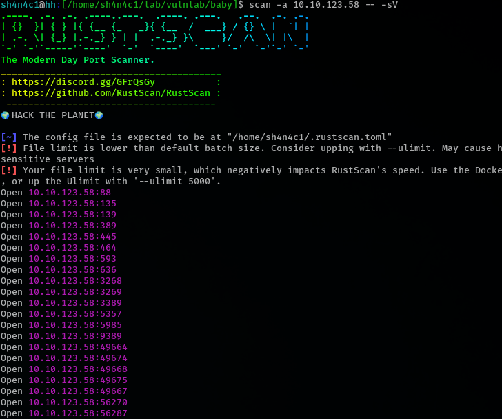

# baby

## port scan

88 port open, this maybe Domain Controller

## service enumeration

no smb

name is babydc.baby.vl

ldap allow anonymouse search

we have cred `BabyStart123!`

## change user password

baby.vl\Caroline.Robinson:BabyStart123! STATUS_PASSWORD_MUST_CHANGE which mean we must change this user password. we can use smbpasswd

## winrm

after change Caroline.Robinson password, we can winrm into target

## root

we have SeBackupPrivilege

we have use robocopy to read flag
there are many way to use SeBackupPrivilege.this is just easy way

