# Escape (easy)

## port scan

just 3389 (rdp) open

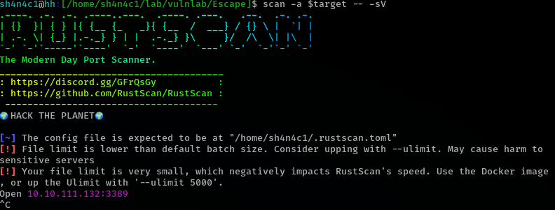

## rdp

```bash
rdesktop 10.10.111.132
```

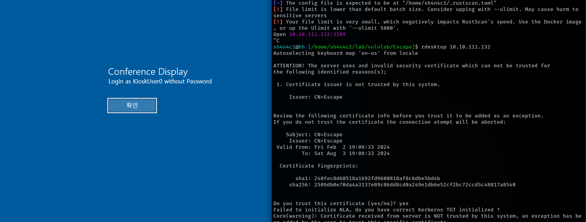

## bypass sandbox

kioskuser0 user exist

```bash
xfreerdp /u:"kioskuser0" /p:"" /v:"$target"
```

it is edge

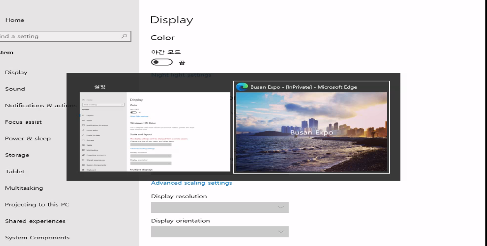

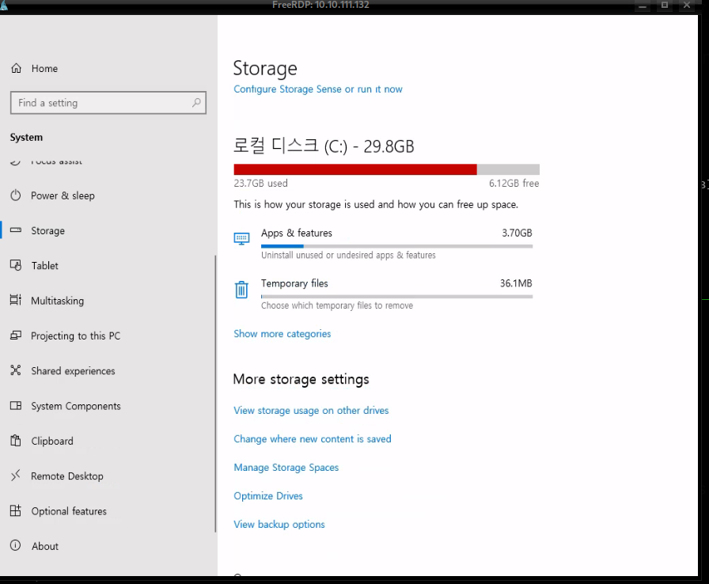

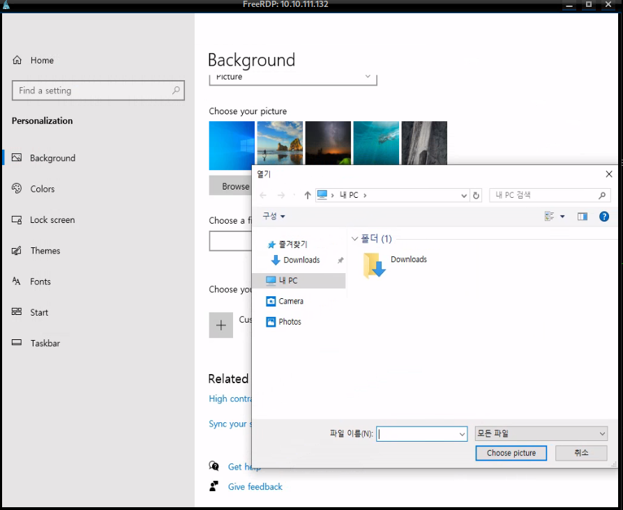

looks like we can't fond everything. it seems a sandbox

but we can launch edge browser with press [win] and then press [win + s]

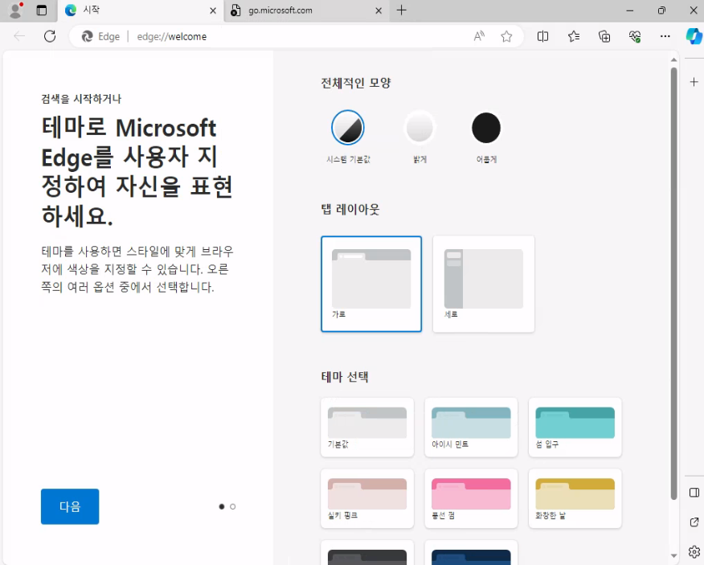

we can read file
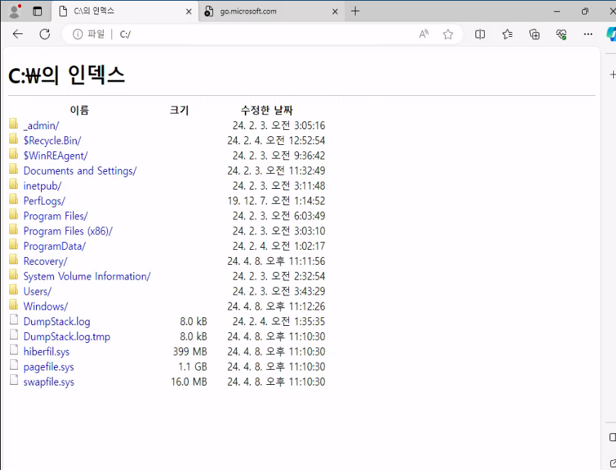

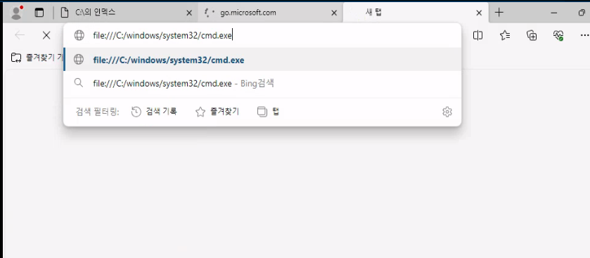

we can download cmd.exe

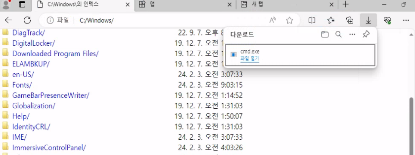

we can't use right click to rename cmd.exe
but we can use F2 shotcut rename it. the only application can run which is `msedge.exe`

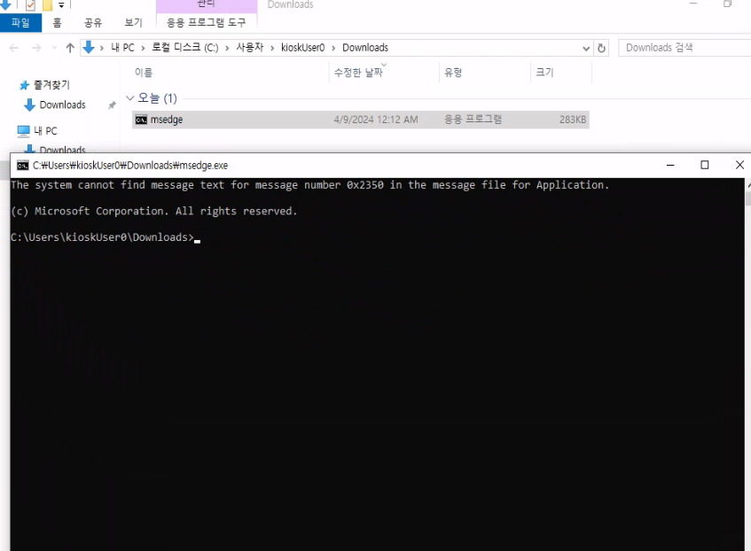

## read rdp password

get beacon

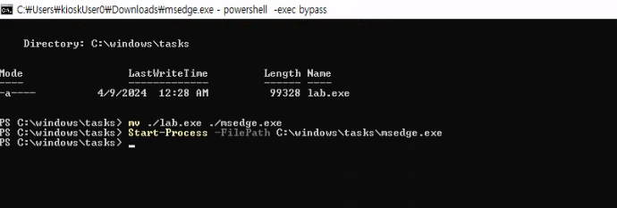

and there have a hidden folder

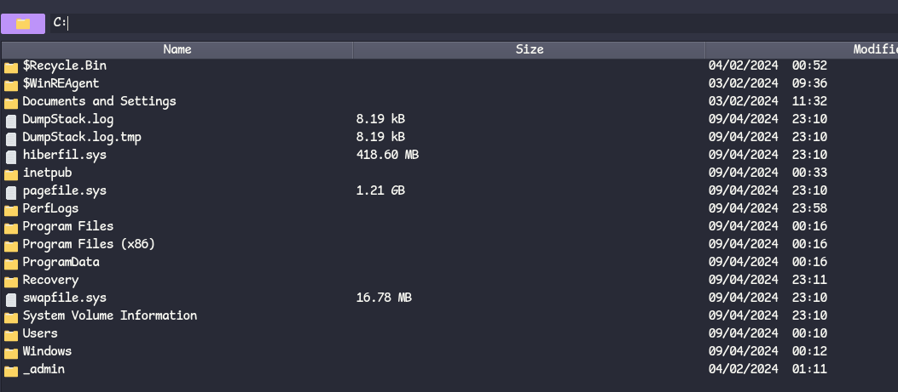

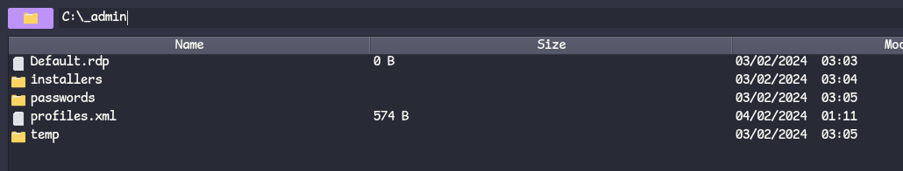

looks like rdp config file. And the rdp software is called "Remote Desktop Plus"

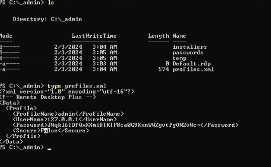

launch rdp.exe

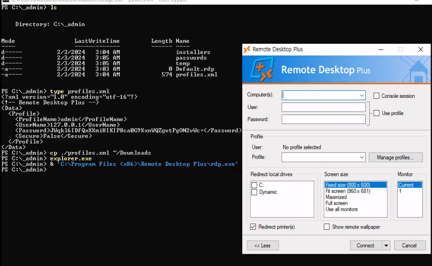

and import profile

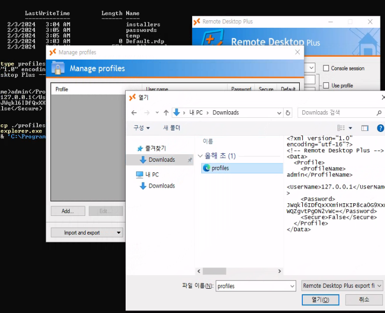

but we can't see password

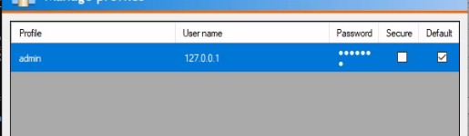

we can open edit profile
and then open this tool to show password

http://www.nirsoft.net/utils/bullets_password_view.html

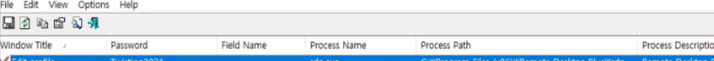

```powershell
runas /user:admin powershell.exe
```

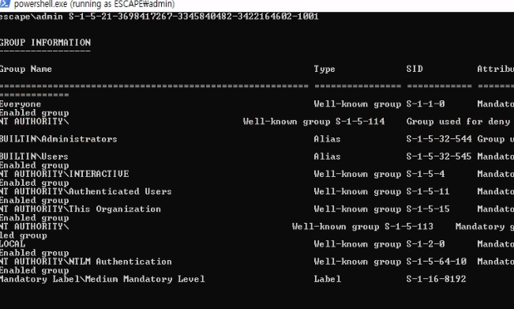

we are in administrator group. but there is UAC. we must bypass UAC

## bypass UAC

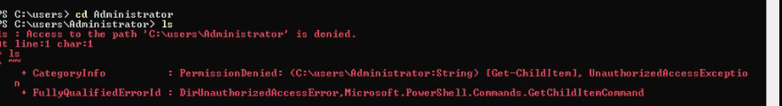

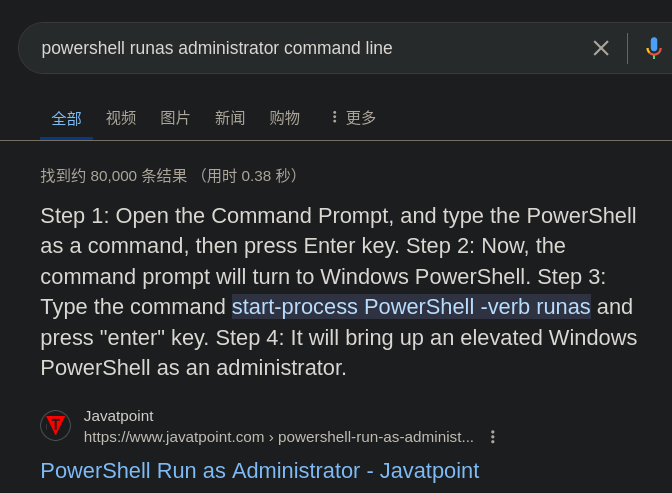

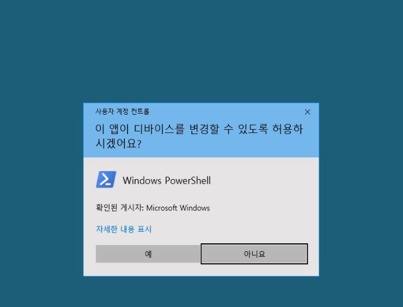

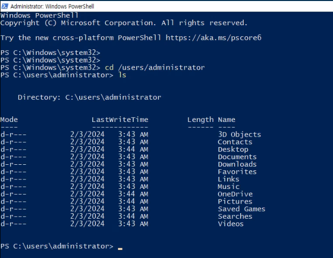
