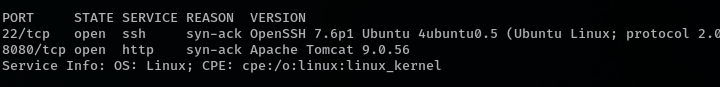
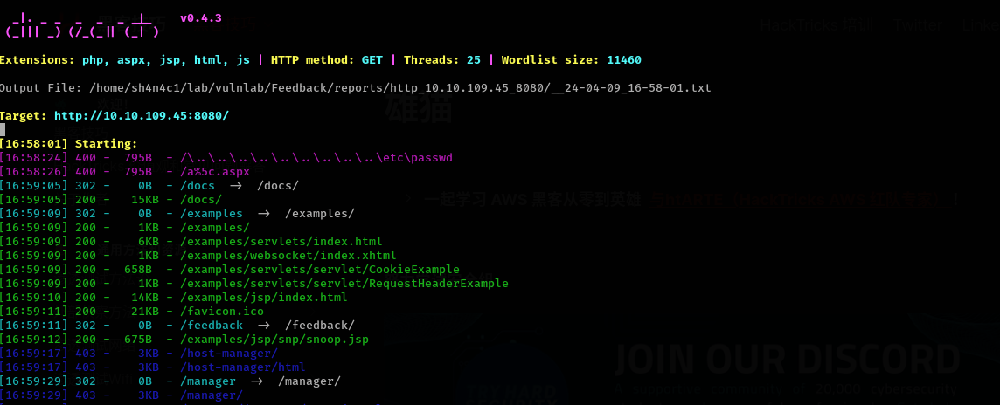
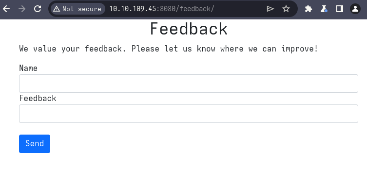
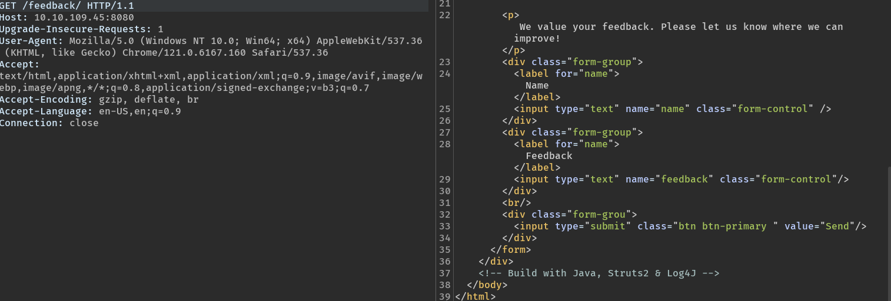
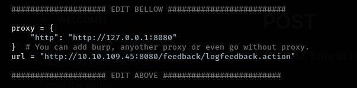
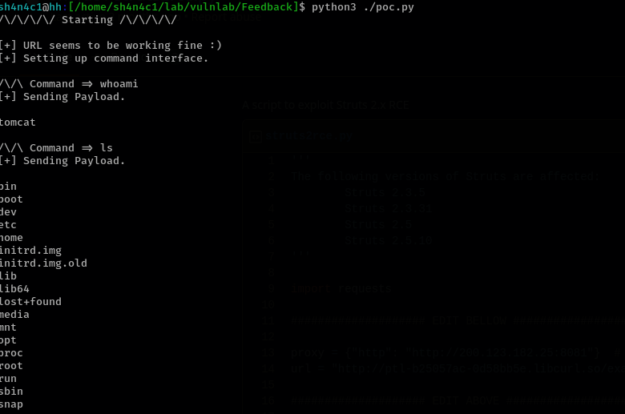
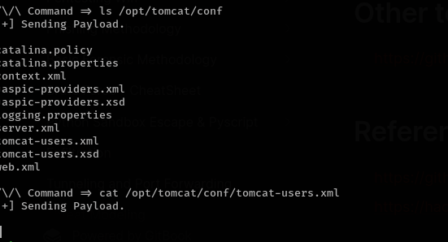
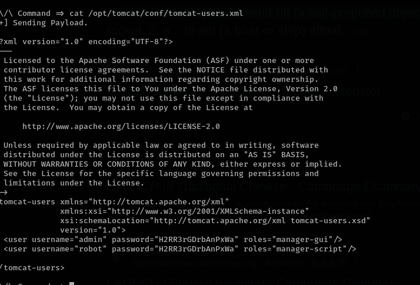
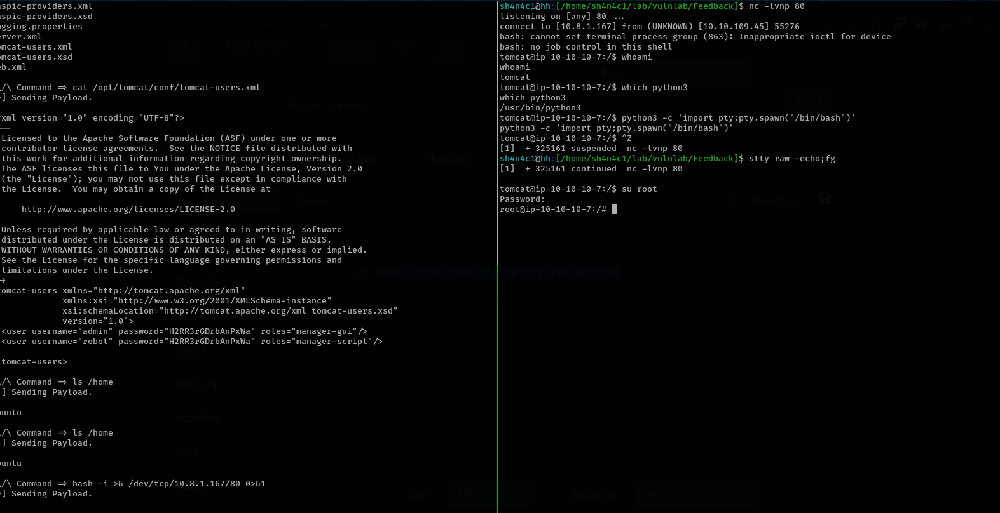

# Feedback (easy)

## port scan




## service enumeration

apache tomcat looks interesting

we can't access tomcat manage page, so brute path









```
       <!-- Build with Java, Struts2 & Log4J -->     
```


there have Log4J,Struts2 software

## exploit

there is a Struts2 RCE
https://gist.github.com/shafdo/8ad7590ed1a08392cbf22d20a2fbb862

and we need to change url and proxy



launch!




# Post Exploitation

we should read tomcat config file beacuse there have tomcat manage page login cred






# Privilege Escalation

we can use cred found in tomcat-user.xml to login as root

get a reverse shell (ssh via key auth). and `su root`


