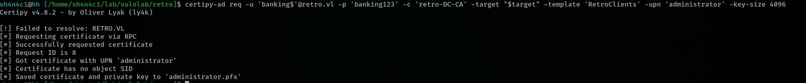

# Retro (easy)

## port scan


## service enumeration


## brute force


since the admin say 'Dear Trainees' and 'bundle every one'

we can make a quicky username list


`trainee` user looks interesting. this account seems have weak password, because admin say `struggle with remembering strong passwords`

make a small password list


now we have valid cred `trainee@retro.vl:trainee`


we can use trainee user access Notes smb share


so we have some new username. `We should start with the pre created
computer account` tell us we will focus on some account end with `$`

again, create a short username list

i think the `banking` user is computer account

banking user also have weak password `banking@retro.vl:banking`


## pre create computer account abuse


https://github.com/SecureAuthCorp/impacket/pull/1304


now we can access smb with banking$ user


## attack adcs

```
certipy-ad find -username 'banking$' -password 'banking123' -dc-ip $target -stdout -vulnerable
```

the ESC1 template is vulnerable, and computers account can enroll. we can use banking user finish this attack





