# Sync (easy)

## port scan


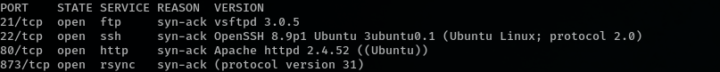

## service enumeration


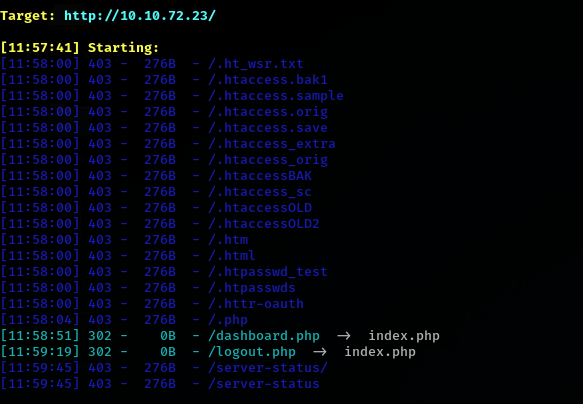

## rsync discover

since there have a serivce called rsync

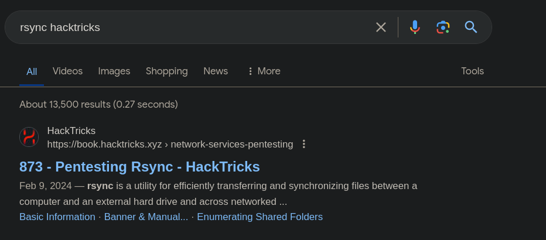

```
@RSYNCD: 31.0
#list
```


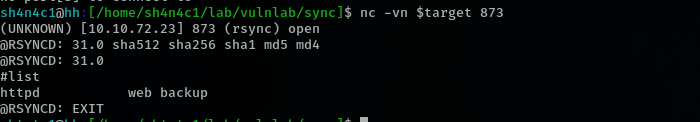

and we have `web backup`

more enumeration

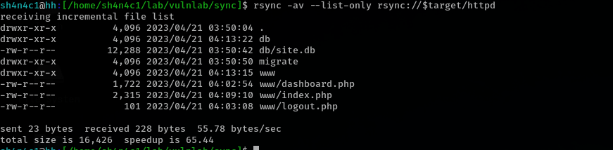

dump web backup

```bash
rsync -av rsync://$target/httpd  ./backup
```


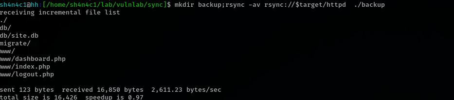


## crack custom encrypt hash

on db folder, we can see there have a site.db. 

triss:a0de4d7f81676c3ea9eabcadfd2536f6
admin:7658a2741c9df3a97c819584db6e6b3c


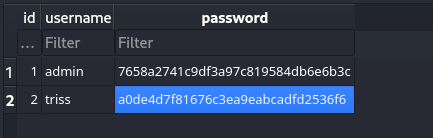

on index.php, we can see how the webapp encrypt password

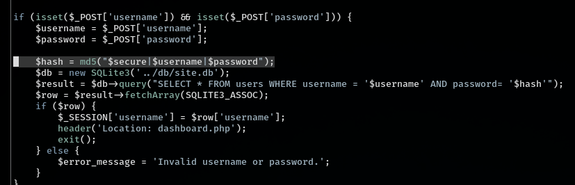

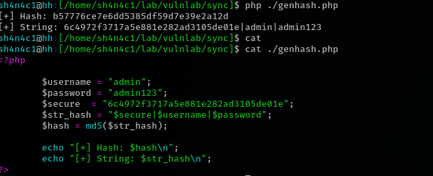

so we can use cracken generate a wordlist

```bash
cracken -w /usr/share/wordlists/rockyou.txt '6c4972f3717a5e881e282ad3105de01e|triss|?w1' > wordlist
```

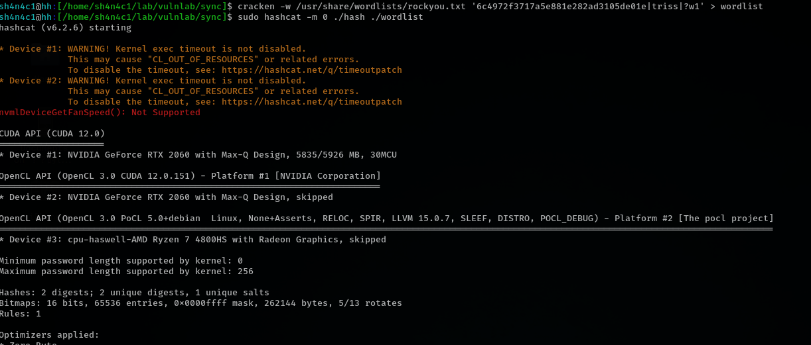

cracked !

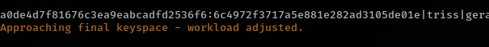


## ssh login as triss

we can use cracked cred login into ftp service

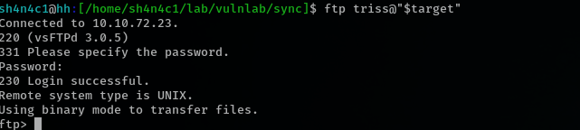

seems we are in /home/triss/

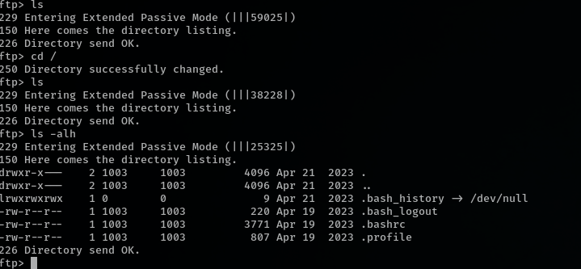

generate ssh key pair

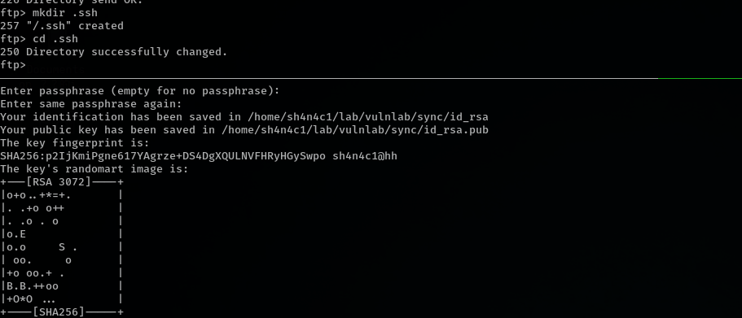

```bash
mkdir .ssh
put id_rsa.pub ./authorized_keys
chmod 0644 ./authorized_keys
```

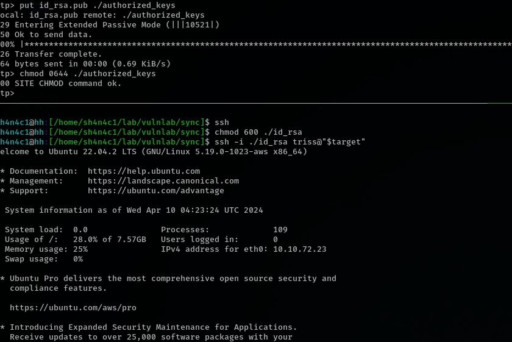


## login as jennifer

there have a user called jennifer found on /home folder
.we can use same cred login as jennifer


## privilege escalation

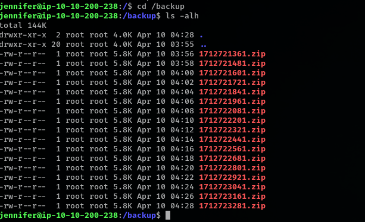


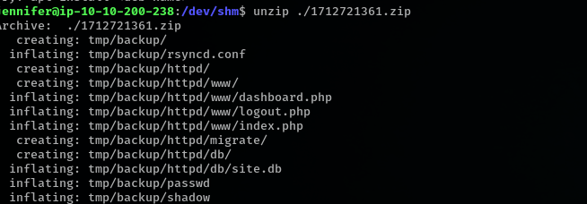

mabey some crontab stuff running? i will upload pspy

yes, we can see there have a backup script running

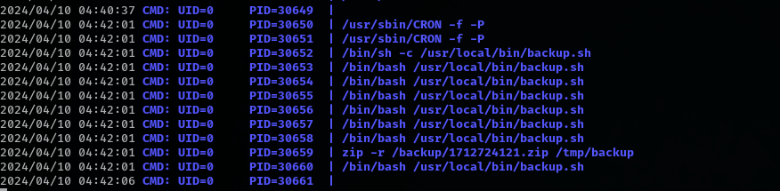

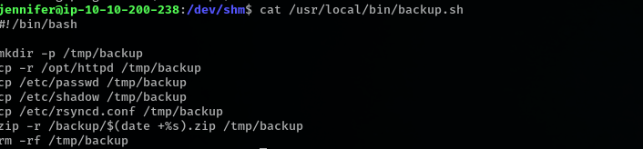

this script will create a `/tmp/backup` folder and add some file into. and then zip all file into /backup folder

we can just create a /tmp/backup too, and then link to flag file or ssh key. the script will backup file which we want

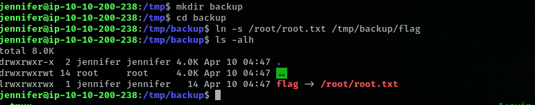

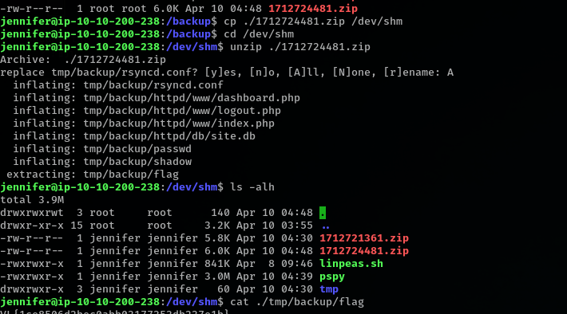