# Trusted (chain) (easy)


## port scan


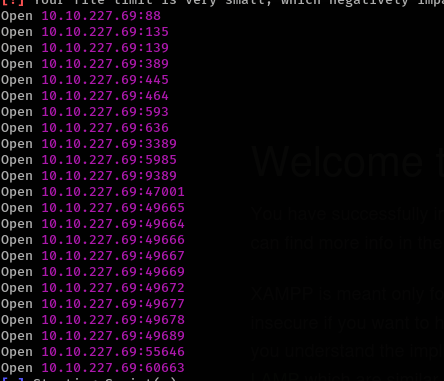


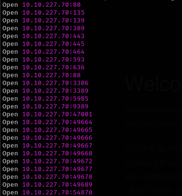


## service enumeration

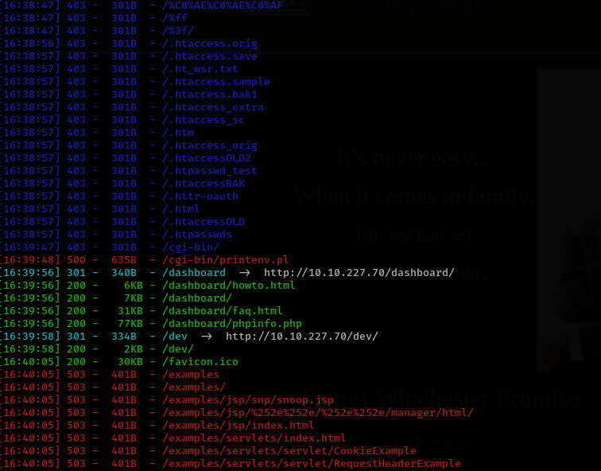


## LFI

we have lfi 

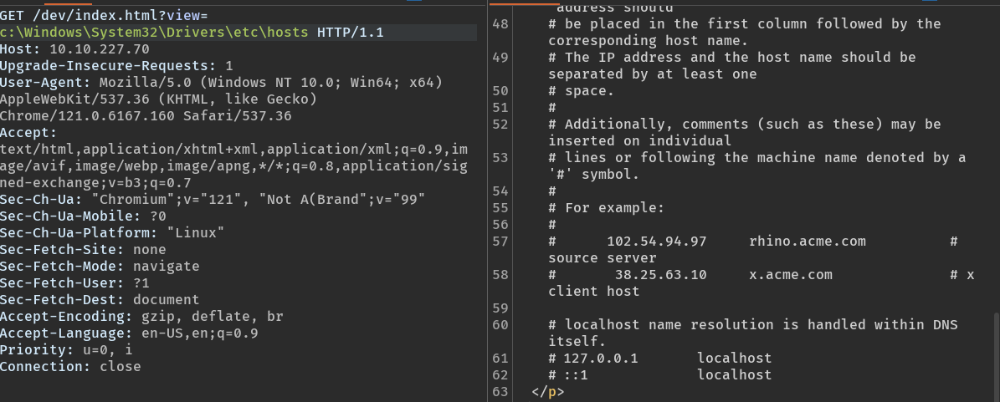

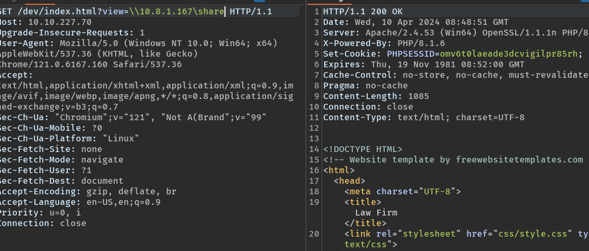

work

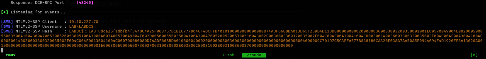

there have a db.php

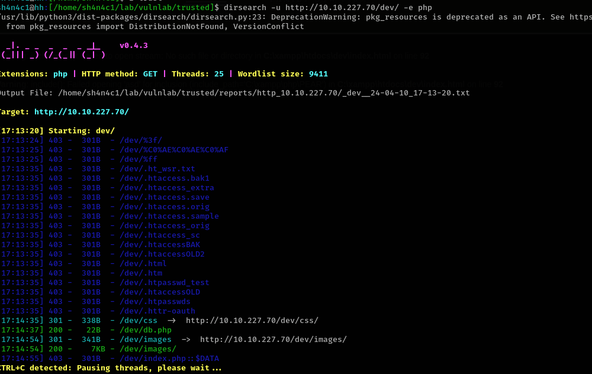

we can use 

```
php://filter/convert.base64-encode/resource=C:\xampp\htdocs\dev\db.php
```

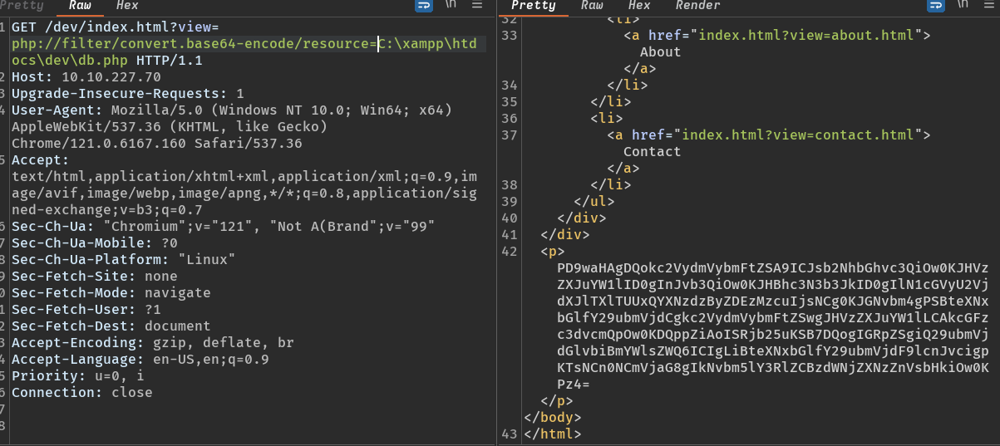

and we have sql cred

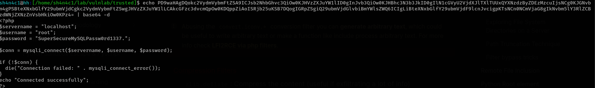

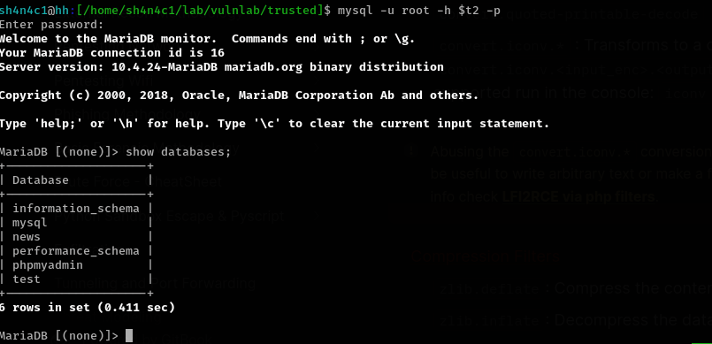

on news DB, we can see some cred

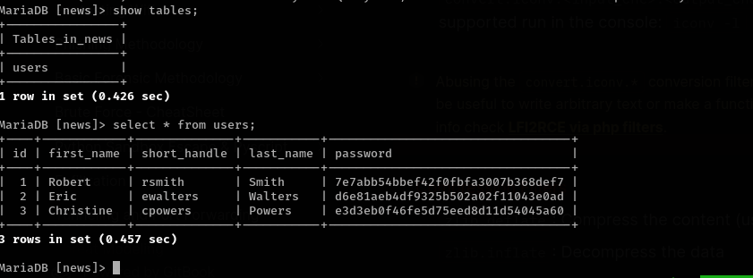

crackstation show us some cracked hash `rsmith:IHateEric2`

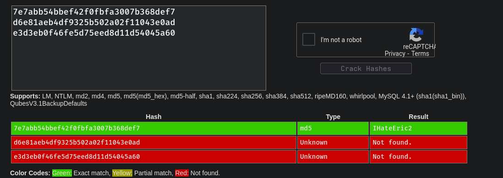

work!

## system on lab

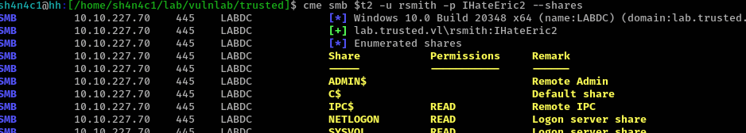

we can write output file


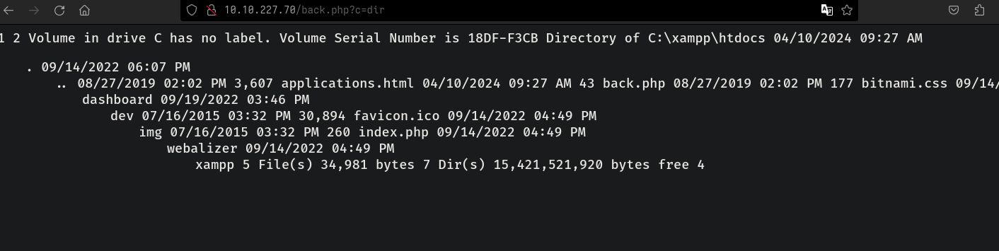

get a beacon

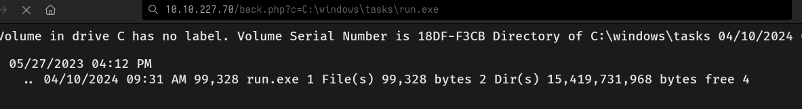

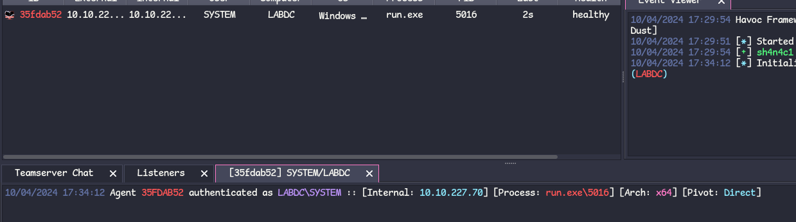

## root on trusteddc

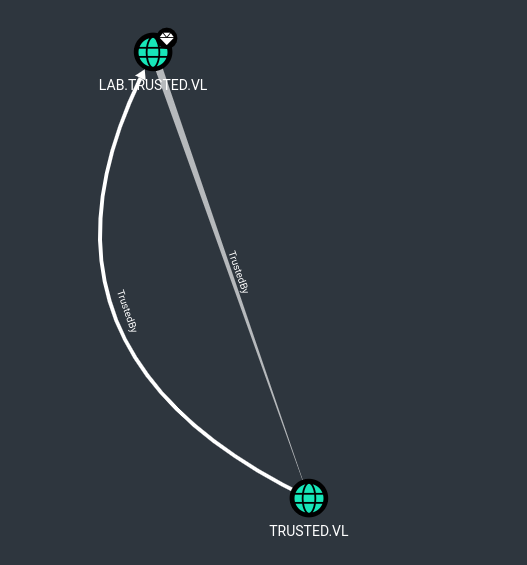

since we are system user on labdc, we can dump KRBTGT user hash and create golden ticket with mimikatz


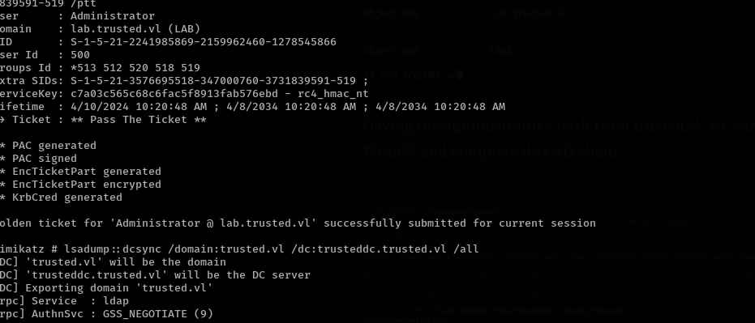

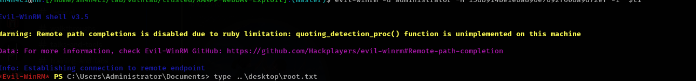